# Final exam place

this repository is for knowledge for final exam of Computer engeneering - Open Informatics at CTU FEE Prague

  Contents:

  - [1. PAL - Polynomial algorithms for standard graph problems. Combinatorial and number-theoretical algorithms, isomorphism, prime numbers. Search trees and their use. Text search based on finite automata.](#1-pal---polynomial-algorithms-for-standard-graph-problems-combinatorial-and-number-theoretical-algorithms-isomorphism-prime-numbers-search-trees-and-their-use-text-search-based-on-finite-automata)
    - [ ] [1.1 Notation of asymptotic complexity of algorithms. Basic notation of graph problems - degree, path, circuit, cycle. Graph representations by adjacency, distance, Laplacian and incidence matrices. Adjacency list representation.](#11-notation-of-asymptotic-complexity-of-algorithms-basic-notation-of-graph-problems---degree-path-circuit-cycle-graph-representations-by-adjacency-distance-laplacian-and-incidence-matrices-adjacency-list-representation)
    - [ ] [1.2 Algorithms for minimum spanning tree (Prim-Jarník, Kruskal, Borůvka), strongly connected components (Kosaraju-Sharir, Tarjan), Euler trail. Union-find problem. Graph isomorphism, tree isomorphism.](#12-algorithms-for-minimum-spanning-tree-prim-jarník-kruskal-borůvka-strongly-connected-components-kosaraju-sharir-tarjan-euler-trail-union-find-problem-graph-isomorphism-tree-isomorphism)
    - [ ] [1.3 Generation and enumeration of combinatorial objects - subsets, k-element subsets, permutations. Gray codes. Prime numbers, sieve of Eratosthenes. Pseudorandom numbers properties. Linear congruential generator.](#13-generation-and-enumeration-of-combinatorial-objects---subsets-k-element-subsets-permutations-gray-codes-prime-numbers-sieve-of-eratosthenes-pseudorandom-numbers-properties-linear-congruential-generator)
    - [ ] [1.4 Search trees - data structures, operations, and their complexities. Binary tree, AVL tree, red-black tree (RB-tree), B-tree and B+ tree, splay tree, k-d tree. Nearest neighbor searching in k-d trees. Skip list.](#14-search-trees---data-structures-operations-and-their-complexities-binary-tree-avl-tree-red-black-tree-rb-tree-b-tree-and-b-tree-splay-tree-k-d-tree-nearest-neighbor-searching-in-k-d-trees-skip-list)
    - [ ] [1.5 Finite automata, regular expressions, operations over regular languages. Bit representation of nondeterministic finite automata. Text search algorithms - exact pattern matching, approximate pattern matching (Hamming and Levenshtein distance), dictionary automata.](#15-finite-automata-regular-expressions-operations-over-regular-languages-bit-representation-of-nondeterministic-finite-automata-text-search-algorithms---exact-pattern-matching-approximate-pattern-matching-hamming-and-levenshtein-distance-dictionary-automata)
  - [2. TAL - Problem/language complexity classes with respect to the time complexity of their solution and memory complexity including undecidable problems/languages.](#2-tal---problemlanguage-complexity-classes-with-respect-to-the-time-complexity-of-their-solution-and-memory-complexity-including-undecidable-problemslanguages)
    - [ ] [2.1 Asymptotic growth of functions, time and space complexity of algorithms. Correctness of algorithms - variant and invariant.](#21-asymptotic-growth-of-functions-time-and-space-complexity-of-algorithms-correctness-of-algorithms---variant-and-invariant)
    - [ ] [2.2 Deterministic Turing machines, multitape Turing machines, and Nondeterministic Turing machines.](#22-deterministic-turing-machines-multitape-turing-machines-and-nondeterministic-turing-machines)
    - [ ] [2.3 Decision problems and languages. Complexity classes P, NP, co-NP. Reduction and polynomial reduction, class NPC. Cook theorem. Heuristics and approximate algorithms for solving NP complete problems.](#23-decision-problems-and-languages-complexity-classes-p-np-co-np-reduction-and-polynomial-reduction-class-npc-cook-theorem-heuristics-and-approximate-algorithms-for-solving-np-complete-problems)
    - [ ] [2.4 Classes based on space complexity: PSPACE and NPSPACE. Savitch Theorem.](#24-classes-based-on-space-complexity-pspace-and-npspace-savitch-theorem)
    - [ ] [2.5 Randomized algorithms. Randomized Turing machines. Classes based on randomization: RP, ZPP, co-RP.](#25-randomized-algorithms-randomized-turing-machines-classes-based-on-randomization-rp-zpp-co-rp)
    - [ ] [2.6 Decidability and undecidability. Recursive and recursively enumerable languages. Diagonal language. Universal language and Universal Turing machine.](#26-decidability-and-undecidability-recursive-and-recursively-enumerable-languages-diagonal-language-universal-language-and-universal-turing-machine)
  - [3. KO - Combinatorial optimization problems - formulation, complexity analysis, algorithms and example applications.](#3-ko---combinatorial-optimization-problems---formulation-complexity-analysis-algorithms-and-example-applications)
    - [ ] [3.1 Integer Linear Programming. Shortest paths problem and traveling salesman problem ILP formulations. Branch and Bound algorithm. Problem formulations using ILP. Special ILP problems solvable in polynomial time.](#31-integer-linear-programming-shortest-paths-problem-and-traveling-salesman-problem-ilp-formulations-branch-and-bound-algorithm-problem-formulations-using-ilp-special-ilp-problems-solvable-in-polynomial-time)
    - [ ] [3.2 Shortest paths problem. Dijkstra, Bellman-Ford, and Floyd–Warshall algorithms. Shortest paths in directed acyclic graphs. Problem formulations using shortest paths.](#32-shortest-paths-problem-dijkstra-bellman-ford-and-floydwarshall-algorithms-shortest-paths-in-directed-acyclic-graphs-problem-formulations-using-shortest-paths)
    - [ ] [3.3 Network flows. Maximum flow and minimum cut problems. Ford-Fulkerson algorithm.  Feasible flow with balances. Minimum cost flow and cycle-canceling algorithm. Problem formulations using network flows. Maximum cardinality matching.](#33-network-flows-maximum-flow-and-minimum-cut-problems-ford-fulkerson-algorithm--feasible-flow-with-balances-minimum-cost-flow-and-cycle-canceling-algorithm-problem-formulations-using-network-flows-maximum-cardinality-matching)
    - [ ] [3.4 Knapsack problem. Approximation algorithm, dynamic programming approach, approximation scheme.](#34-knapsack-problem-approximation-algorithm-dynamic-programming-approach-approximation-scheme)
    - [ ] [3.5 Traveling salesman problem. Double-tree algorithm and Christofides algorithm for the metric problem. Local search k-OPT.](#35-traveling-salesman-problem-double-tree-algorithm-and-christofides-algorithm-for-the-metric-problem-local-search-k-opt)
    - [ ] [3.6 Scheduling - problem description and notation. One resource - Bratley algorithm, Horn algorithm. Parallel identical resources - list scheduling, dynamic programming. Project scheduling with temporal constraints - relative order and time-indexed ILP formulations.](#36-scheduling---problem-description-and-notation-one-resource---bratley-algorithm-horn-algorithm-parallel-identical-resources---list-scheduling-dynamic-programming-project-scheduling-with-temporal-constraints---relative-order-and-time-indexed-ilp-formulations)
    - [ ] [3.7 Constraint Satisfaction Problem. AC3 algorithm.](#37-constraint-satisfaction-problem-ac3-algorithm)
  - [4. ISC - Design and implementation of in-chip integrated systems, application specific systems.](#4-isc---design-and-implementation-of-in-chip-integrated-systems-application-specific-systems)
    - [ ] [4.1 Main features and economical aspects of the Application specific integrated circuits systems: full custom design, gate array, standard cells, programmable array logic;](#41-main-features-and-economical-aspects-of-the-application-specific-integrated-circuits-systems-full-custom-design-gate-array-standard-cells-programmable-array-logic)
    - [ ] [4.2 Design principles of mix-signal integrated circuits, purpose of hierarchical design, digital and analogue block interface, CAD design tools for automatic circuit generation; functional and static time analysis, formal verification; Verilog-A, Verilog-AMS, VHDL-A.](#42-design-principles-of-mix-signal-integrated-circuits-purpose-of-hierarchical-design-digital-and-analogue-block-interface-cad-design-tools-for-automatic-circuit-generation-functional-and-static-time-analysis-formal-verification-verilog-a-verilog-ams-vhdl-a)
    - [ ] [4.3 Front end design - functional specification, RTL, logic synthesis, Gate-level netlist, behavioral stimulus extraction.](#43-front-end-design---functional-specification-rtl-logic-synthesis-gate-level-netlist-behavioral-stimulus-extraction)
    - [ ] [4.4 Back End design - specification of Design Kit, Floorplanning, place and route, layout, parasitic extraction, layout versus schema check (LVS).](#44-back-end-design---specification-of-design-kit-floorplanning-place-and-route-layout-parasitic-extraction-layout-versus-schema-check-lvs)
    - [ ] [4.5 Tape out and IC fabrication process, integrated systems verification, scaling and design mapping to different technologies.](#45-tape-out-and-ic-fabrication-process-integrated-systems-verification-scaling-and-design-mapping-to-different-technologies)
  - [5. PAP - Advanced architectures of processors, memory and peripheral circuits and multiprocessor computers.](#5-pap---advanced-architectures-of-processors-memory-and-peripheral-circuits-and-multiprocessor-computers)
    - [ ] [5.1 Superscalar techniques used in nodes of multiprocessor systems, data flow inside the processor, Tomasulo algorithm and its deficiencies, precise exceptions support, architectural state, register renaming, reservation station, reorder buffer, instruction fetch, decode, dispatch, issue, execute, finish, complete, reorder, branch prediction, store forwarding, hit under miss.](#51-superscalar-techniques-used-in-nodes-of-multiprocessor-systems-data-flow-inside-the-processor-tomasulo-algorithm-and-its-deficiencies-precise-exceptions-support-architectural-state-register-renaming-reservation-station-reorder-buffer-instruction-fetch-decode-dispatch-issue-execute-finish-complete-reorder-branch-prediction-store-forwarding-hit-under-miss)
    - [ ] [5.2 Relation between memory coherency and consistency, their implementation on systems with shared bus and when multiple rings topologies are used, MESI, MOESI, home directory.](#52-relation-between-memory-coherency-and-consistency-their-implementation-on-systems-with-shared-bus-and-when-multiple-rings-topologies-are-used-mesi-moesi-home-directory)
    - [ ] [5.3 Rules for execution synchronization and data exchange in multiprocessor systems, mutex implementation, relation to consistency models and mechanisms to achieve expected algorithms behavior on systems with relaxed consistency models (PRAM, PSO, TSO, PC, barrier instructions).](#53-rules-for-execution-synchronization-and-data-exchange-in-multiprocessor-systems-mutex-implementation-relation-to-consistency-models-and-mechanisms-to-achieve-expected-algorithms-behavior-on-systems-with-relaxed-consistency-models-pram-pso-tso-pc-barrier-instructions)
    - [ ] [5.4 SMP and NUMA nodes interconnections networks, conflicts and rearrangeable networks, Beneš network.](#54-smp-and-numa-nodes-interconnections-networks-conflicts-and-rearrangeable-networks-beneš-network)
    - [ ] [5.5 Parallel computations on multiprocessor systems, OpenMP on NUMA and MPI on distributed memory systems, their combinations.](#55-parallel-computations-on-multiprocessor-systems-openmp-on-numa-and-mpi-on-distributed-memory-systems-their-combinations)
  - [6. KRP - I/O and network interfaces of computer and embedded systems, hardware and software implementation.](#6-krp---io-and-network-interfaces-of-computer-and-embedded-systems-hardware-and-software-implementation)
    - [ ] [6.1 USB I/O subsystem, structure and functionality of elements, protocol stack,transfer - transaction - packet hierarchy, transfer types and pipes, bandwidth allocation principles, enumeration process and PnP, descriptor hierarchy, USB device implementation.](#61-usb-io-subsystem-structure-and-functionality-of-elements-protocol-stacktransfer---transaction---packet-hierarchy-transfer-types-and-pipes-bandwidth-allocation-principles-enumeration-process-and-pnp-descriptor-hierarchy-usb-device-implementation)
    - [ ] [6.2 PCI Express (PCI) I/O subsystems, basic differences and commons of PCI and PCIe, protocol stack, transaction types, packet routing principles, quality of service support, PnP and enumeration process.](#62-pci-express-pci-io-subsystems-basic-differences-and-commons-of-pci-and-pcie-protocol-stack-transaction-types-packet-routing-principles-quality-of-service-support-pnp-and-enumeration-process)
    - [ ] [6.3 Ethernet based networking, VLAN, precision time protocol (PTP), stream reservation protocol (SRP), time sensitive networks (TSN).](#63-ethernet-based-networking-vlan-precision-time-protocol-ptp-stream-reservation-protocol-srp-time-sensitive-networks-tsn)
    - [ ] [6.4 In-vehicle networking, Controller Area Network (CAN, CAN-FD), Local Interconnect Network (LIN), FlexRay, data-link layer algorithms, physical topology constraints and relation to system design.](#64-in-vehicle-networking-controller-area-network-can-can-fd-local-interconnect-network-lin-flexray-data-link-layer-algorithms-physical-topology-constraints-and-relation-to-system-design)
  - [7. AVS - ARM based microcontrollers and signal processors; their functionality. Design and implementation of embedded systems for typical application areas.](#7-avs---arm-based-microcontrollers-and-signal-processors-their-functionality-design-and-implementation-of-embedded-systems-for-typical-application-areas)
    - [x] [7.1 Typical architecture and main features of ARM based microcontrollers. AMBA. I/O pin configuration. Common used peripheral circuits (I/O ports, timers, DMA controllers, NVIC controller, JTAG, SWD, A/D converters, D/A converters, SPI controllers, I2C controllers, UART, FLASH and SRAM memory).](#71-typical-architecture-and-main-features-of-arm-based-microcontrollers-amba-io-pin-configuration-common-used-peripheral-circuits-io-ports-timers-dma-controllers-nvic-controller-jtag-swd-ad-converters-da-converters-spi-controllers-i2c-controllers-uart-flash-and-sram-memory)
    - [x] [7.2 Typical architecture and main features of digital signal processors (DSP). Common used peripheral circuits. Special computational units and their features (ALU, MAC, SHIFT BARREL register, DAG).](#72-typical-architecture-and-main-features-of-digital-signal-processors-dsp-common-used-peripheral-circuits-special-computational-units-and-their-features-alu-mac-shift-barrel-register-dag)
    - [ ] [7.3 Digital signal processing: signal spectrum analysis (DFT, IDFT), correlation functions and their typical use, digital filters (FIR, IIR), signal interpolation, signal decimation.](#73-digital-signal-processing-signal-spectrum-analysis-dft-idft-correlation-functions-and-their-typical-use-digital-filters-fir-iir-signal-interpolation-signal-decimation)
    - [x] [7.4 Types of A/D converters. Sampling theorem. Anti-aliasing filter (AAF). Direct digital synthesis (DDS).](#74-types-of-ad-converters-sampling-theorem-anti-aliasing-filter-aaf-direct-digital-synthesis-dds)
    - [ ] [7.5 User controls interfacing to microcontrollers (buttons, rotary encoders, graphic LCD, audio codecs, power switches, relays, contactors). Motion control (brush DC motor, stepper motor and brushless DC motor control).](#75-user-controls-interfacing-to-microcontrollers-buttons-rotary-encoders-graphic-lcd-audio-codecs-power-switches-relays-contactors-motion-control-brush-dc-motor-stepper-motor-and-brushless-dc-motor-control)
  - [8. PAG - Properties of parallel and distributed algorithms. Communication operations for parallel algorithms. Parallel algorithms for linear algebra. BE4M35PAG (Course web pages)](#8-pag---properties-of-parallel-and-distributed-algorithms-communication-operations-for-parallel-algorithms-parallel-algorithms-for-linear-algebra-be4m35pag-course-web-pages)
    - [ ] [8.1 Describe basic communication operations used in parallel algorithms. Show cost analysis of one-to-all broadcast, all-to-all-broadcast, scatter, and all-to-all personalized communication on a ring, mesh, and hypercube. Describe All-Reduce and Prefix-Sum operations and outline their usage.](#81-describe-basic-communication-operations-used-in-parallel-algorithms-show-cost-analysis-of-one-to-all-broadcast-all-to-all-broadcast-scatter-and-all-to-all-personalized-communication-on-a-ring-mesh-and-hypercube-describe-all-reduce-and-prefix-sum-operations-and-outline-their-usage)
    - [ ] [8.2 Describe performance metrics and scalability for parallel systems. How efficiency of a parallel algorithm depends on the problem size and the number of processors? Derive isoefficiency functions of a parallel algorithm for adding numbers (including communication between processors) and explain how it characterizes the algorithm.](#82-describe-performance-metrics-and-scalability-for-parallel-systems-how-efficiency-of-a-parallel-algorithm-depends-on-the-problem-size-and-the-number-of-processors-derive-isoefficiency-functions-of-a-parallel-algorithm-for-adding-numbers-including-communication-between-processors-and-explain-how-it-characterizes-the-algorithm)
    - [ ] [8.3 Explain and compare two parallel algorithms for matrix-vector multiplication. Describe a parallel algorithm for matrix-matrix multiplication and explain the idea of Cannon’s algorithm. Discuss the principle and properties of the DNS algorithm used for matrix-matrix multiplication.](#83-explain-and-compare-two-parallel-algorithms-for-matrix-vector-multiplication-describe-a-parallel-algorithm-for-matrix-matrix-multiplication-and-explain-the-idea-of-cannons-algorithm-discuss-the-principle-and-properties-of-the-dns-algorithm-used-for-matrix-matrix-multiplication)
    - [ ] [8.4 Outline the principle of sorting networks and describe parallel bitonic sort, including its scalability. Explain parallel enumeration sort algorithm on PRAM model, including its scalability.](#84-outline-the-principle-of-sorting-networks-and-describe-parallel-bitonic-sort-including-its-scalability-explain-parallel-enumeration-sort-algorithm-on-pram-model-including-its-scalability)
    - [ ] [8.5 Explain all steps of a parallel algorithm for finding connected components in a graph given by the adjacency matrix. Using an example, illustrate a parallel algorithm for finding a maximal independent set in a sparse graph.](#85-explain-all-steps-of-a-parallel-algorithm-for-finding-connected-components-in-a-graph-given-by-the-adjacency-matrix-using-an-example-illustrate-a-parallel-algorithm-for-finding-a-maximal-independent-set-in-a-sparse-graph)
  - [9. ESW - Effective algorithms and optimization methods. Data structures, synchronization and multithreaded programs.](#9-esw---effective-algorithms-and-optimization-methods-data-structures-synchronization-and-multithreaded-programs)
    - [ ] [9.1 Java Virtual Machine, memory layout, frame, stack-oriented machine processing, ordinary object pointer, compressed ordinary object pointer. JVM bytecode, Just-in-time compiler, tired compilation, on-stack replacement, disassembler, decompiler. Global and local safe point, time to safe point. Automatic memory Management, generational hypothesis, garbage collectors. CPU and memory profiling, sampling and tracing approach, warm-up phase.](#91-java-virtual-machine-memory-layout-frame-stack-oriented-machine-processing-ordinary-object-pointer-compressed-ordinary-object-pointer-jvm-bytecode-just-in-time-compiler-tired-compilation-on-stack-replacement-disassembler-decompiler-global-and-local-safe-point-time-to-safe-point-automatic-memory-management-generational-hypothesis-garbage-collectors-cpu-and-memory-profiling-sampling-and-tracing-approach-warm-up-phase)
    - [ ] [9.2 Data races, CPU pipelining and superscalar architecture, memory barrier, volatile variable.  Synchronization - thin, fat and biased locking, reentrant locks. Atomic operations based on compare-and-set instructions, atomic field updaters. Non-blocking algorithms, wait free algorithms, non-blocking stack (LIFO).](#92-data-races-cpu-pipelining-and-superscalar-architecture-memory-barrier-volatile-variable--synchronization---thin-fat-and-biased-locking-reentrant-locks-atomic-operations-based-on-compare-and-set-instructions-atomic-field-updaters-non-blocking-algorithms-wait-free-algorithms-non-blocking-stack-lifo)
    - [ ] [9.3 Static and dynamic memory analysis, shallow and retained size, memory leak. Data Structures, Java primitives and objects, auto-boxing and unboxing, memory efficiency of complex data structures. Collection for performance, type specific collections, open addressing hashing, collision resolution schemes. Bloom filters, complexity, false positives, bloom filter extensions. Reference types - weak, soft, phantom.](#93-static-and-dynamic-memory-analysis-shallow-and-retained-size-memory-leak-data-structures-java-primitives-and-objects-auto-boxing-and-unboxing-memory-efficiency-of-complex-data-structures-collection-for-performance-type-specific-collections-open-addressing-hashing-collision-resolution-schemes-bloom-filters-complexity-false-positives-bloom-filter-extensions-reference-types---weak-soft-phantom)
    - [ ] [9.4 JVM object allocation, thread-local allocation buffers, object escape analysis, data locality, non-uniform memory allocation.](#94-jvm-object-allocation-thread-local-allocation-buffers-object-escape-analysis-data-locality-non-uniform-memory-allocation)
    - [ ] [9.5 Networking, OSI model, C10K problem. Blocking and non-blocking input/output, threading server, event-driven server. Event-based input/output approaches. Native buffers in JVM, channels and selectors.](#95-networking-osi-model-c10k-problem-blocking-and-non-blocking-inputoutput-threading-server-event-driven-server-event-based-inputoutput-approaches-native-buffers-in-jvm-channels-and-selectors)
    - [ ] [9.6 Synchronization in multi-threaded programs (atomic operations, mutex, semaphore, rw-lock, spinlock, RCU). When to use which mechanism? Performance bottlenecks of the mentioned mechanisms. Synchronization in “read-mostly workloads”, advantages and disadvantages of different synchronization mechanisms.](#96-synchronization-in-multi-threaded-programs-atomic-operations-mutex-semaphore-rw-lock-spinlock-rcu-when-to-use-which-mechanism-performance-bottlenecks-of-the-mentioned-mechanisms-synchronization-in-read-mostly-workloads-advantages-and-disadvantages-of-different-synchronization-mechanisms)
    - [ ] [9.7 Cache-efficient data structures and algorithms (e.g., matrix multiplication). Principles of cache memories, different kinds of cache misses. Self-evicting code, false sharing – what is it and how deal with it?](#97-cache-efficient-data-structures-and-algorithms-eg-matrix-multiplication-principles-of-cache-memories-different-kinds-of-cache-misses-self-evicting-code-false-sharing--what-is-it-and-how-deal-with-it)
    - [ ] [9.8 Profiling and optimizations of programs in compiled languages (e.g., C/C++). Hardware performance counters, profile-guided optimization. Basics of C/C++ compilers, AST, intermediate representation, high-level and low-level optimization passes.](#98-profiling-and-optimizations-of-programs-in-compiled-languages-eg-cc-hardware-performance-counters-profile-guided-optimization-basics-of-cc-compilers-ast-intermediate-representation-high-level-and-low-level-optimization-passes)

## 1. PAL - Polynomial algorithms for standard graph problems. Combinatorial and number-theoretical algorithms, isomorphism, prime numbers. Search trees and their use. Text search based on finite automata.

### 1.1 Notation of asymptotic complexity of algorithms. Basic notation of graph problems - degree, path, circuit, cycle. Graph representations by adjacency, distance, Laplacian and incidence matrices. Adjacency list representation.

### 1.2 Algorithms for minimum spanning tree (Prim-Jarník, Kruskal, Borůvka), strongly connected components (Kosaraju-Sharir, Tarjan), Euler trail. Union-find problem. Graph isomorphism, tree isomorphism.

### 1.3 Generation and enumeration of combinatorial objects - subsets, k-element subsets, permutations. Gray codes. Prime numbers, sieve of Eratosthenes. Pseudorandom numbers properties. Linear congruential generator.

### 1.4 Search trees - data structures, operations, and their complexities. Binary tree, AVL tree, red-black tree (RB-tree), B-tree and B+ tree, splay tree, k-d tree. Nearest neighbor searching in k-d trees. Skip list.
 
### 1.5 Finite automata, regular expressions, operations over regular languages. Bit representation of nondeterministic finite automata. Text search algorithms - exact pattern matching, approximate pattern matching (Hamming and Levenshtein distance), dictionary automata.

## 2. TAL - Problem/language complexity classes with respect to the time complexity of their solution and memory complexity including undecidable problems/languages.

### 2.1 Asymptotic growth of functions, time and space complexity of algorithms. Correctness of algorithms - variant and invariant.

### 2.2 Deterministic Turing machines, multitape Turing machines, and Nondeterministic Turing machines.

### 2.3 Decision problems and languages. Complexity classes P, NP, co-NP. Reduction and polynomial reduction, class NPC. Cook theorem. Heuristics and approximate algorithms for solving NP complete problems.

### 2.4 Classes based on space complexity: PSPACE and NPSPACE. Savitch Theorem.

### 2.5 Randomized algorithms. Randomized Turing machines. Classes based on randomization: RP, ZPP, co-RP.

### 2.6 Decidability and undecidability. Recursive and recursively enumerable languages. Diagonal language. Universal language and Universal Turing machine.

## 3. KO - Combinatorial optimization problems - formulation, complexity analysis, algorithms and example applications. 

### 3.1 Integer Linear Programming. Shortest paths problem and traveling salesman problem ILP formulations. Branch and Bound algorithm. Problem formulations using ILP. Special ILP problems solvable in polynomial time.

### 3.2 Shortest paths problem. Dijkstra, Bellman-Ford, and Floyd–Warshall algorithms. Shortest paths in directed acyclic graphs. Problem formulations using shortest paths.

### 3.3 Network flows. Maximum flow and minimum cut problems. Ford-Fulkerson algorithm.  Feasible flow with balances. Minimum cost flow and cycle-canceling algorithm. Problem formulations using network flows. Maximum cardinality matching.

### 3.4 Knapsack problem. Approximation algorithm, dynamic programming approach, approximation scheme.

### 3.5 Traveling salesman problem. Double-tree algorithm and Christofides algorithm for the metric problem. Local search k-OPT.

### 3.6 Scheduling - problem description and notation. One resource - Bratley algorithm, Horn algorithm. Parallel identical resources - list scheduling, dynamic programming. Project scheduling with temporal constraints - relative order and time-indexed ILP formulations.

### 3.7 Constraint Satisfaction Problem. AC3 algorithm.

## 4. ISC - Design and implementation of in-chip integrated systems, application specific systems.

### 4.1 Main features and economical aspects of the Application specific integrated circuits systems: full custom design, gate array, standard cells, programmable array logic;

### 4.2 Design principles of mix-signal integrated circuits, purpose of hierarchical design, digital and analogue block interface, CAD design tools for automatic circuit generation; functional and static time analysis, formal verification; Verilog-A, Verilog-AMS, VHDL-A.

### 4.3 Front end design - functional specification, RTL, logic synthesis, Gate-level netlist, behavioral stimulus extraction.

### 4.4 Back End design - specification of Design Kit, Floorplanning, place and route, layout, parasitic extraction, layout versus schema check (LVS).

### 4.5 Tape out and IC fabrication process, integrated systems verification, scaling and design mapping to different technologies.

## 5. PAP - Advanced architectures of processors, memory and peripheral circuits and multiprocessor computers. 

### 5.1 Superscalar techniques used in nodes of multiprocessor systems, data flow inside the processor, Tomasulo algorithm and its deficiencies, precise exceptions support, architectural state, register renaming, reservation station, reorder buffer, instruction fetch, decode, dispatch, issue, execute, finish, complete, reorder, branch prediction, store forwarding, hit under miss.

**Data flow inside the processor**

Stages of the pipeline:
- **IF** instruction fetch - load instruction from the instruction memory. 
- **ID** instruction decode - translate the instruction into correct signals for the ALU and other units, load corresponging registers
- **EX** execute - execute the instruction like add two numbers
- **MEM** memory access - write/load to/from memory.
- **WB** write the result back to the register or other storage location.

not all instruction go trough all stages. Like Branch, which does not go to mem and write-back phase

Diversified pipelining - multiple executin units

Dynamic pipelining - out of order execution

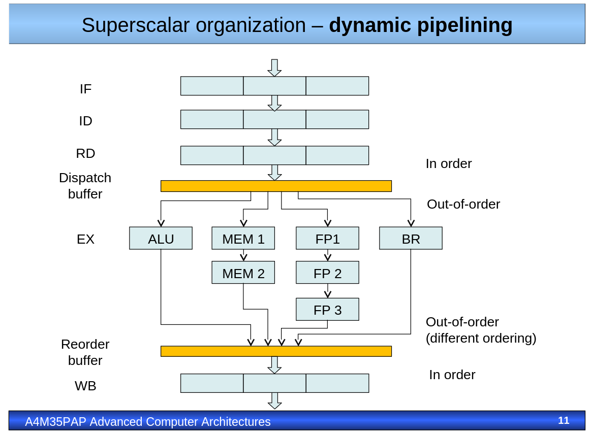

Dispatch buffer - the buffer where the prepared instructions await for the right execution unit to be available

Reorder buffer - the buffer, where the out-of-order instructions are put back in the correct order. Needed to support precise exceptions (complete only the instructions that happened before the exception)

The buffers can be added between all stages to support out-of-order execution on more fronts. They all need to be tracked to be correcly positoined in completion buffer.

Superscalar organisation:
- **Fetch** - the pipeline has width W (number of parallel pipelines). Fetch able to load W instructions from instruction Cache in every cycle. I-cache must be wide enough to store W instructions, that can be accessed at the same time. The loading can be degraded by unaligned instructions and jump instructions (we load not from the beginning of the line)
Solution: Static(Compilator chooses best placement) Dynamic(Solved by Hardware during runtime)\
The un-alignment can be solved by T-Logic - two way associative cache.

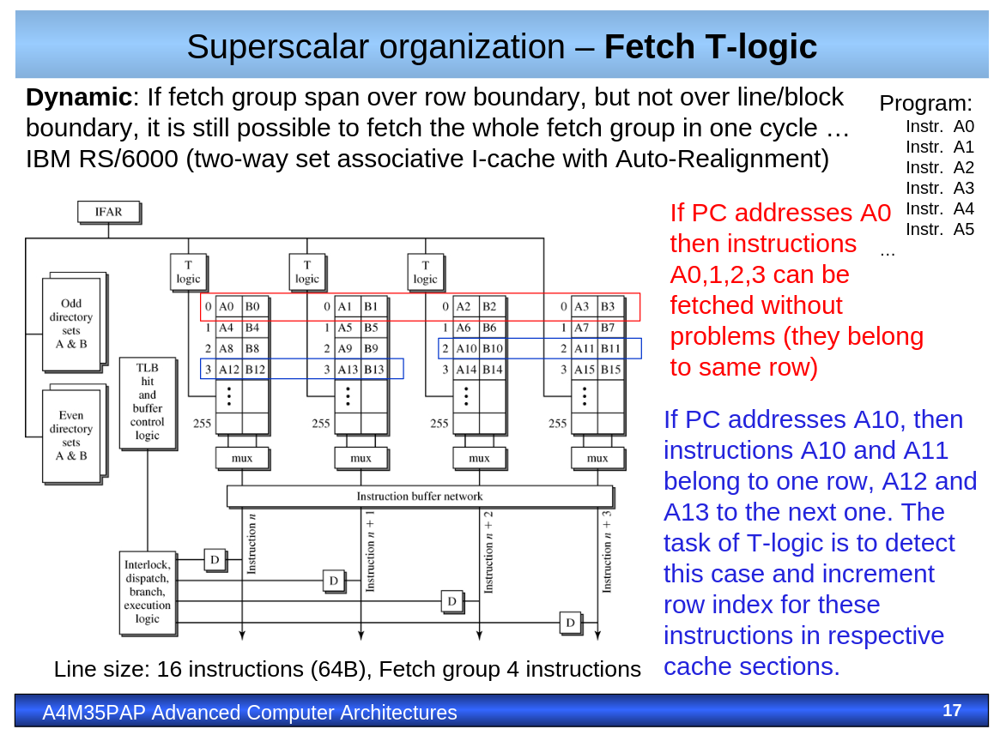

- **Decode** - the complexity is wildly different when decoding CISC/RISC instructions. Tasks:
  - indetify the infividual instructions (and even lengths for CISC)  
  - determine instruction types
  - detect inner dependencies, determine set of independent instructions to dispatch to next stages\
can contain Predecoding - if i-cache misses the instructions while loading from memory to the Cache are partialy decoded, to be searched for the potential jumps and identifiaction of independant instructions, which then simplyfies the Decode Process.
- **Dispatch** - route the insturctions to the corresponding functional units for execution. The operand values might not be ready for some instructions, solved by stall, or using reservation stations (buffers). We distinguish:
  - Centralized reservation stations
  - Distributed reservation stations
  - Hybrid reservation stations (or clustered)\
  Dispatching - assign the functional unit for execution to the instruction
  Issue - initialize execution of the instruction

Centralized reservation station|  Distributed reservation station
:-------------------------:|:-------------------------:
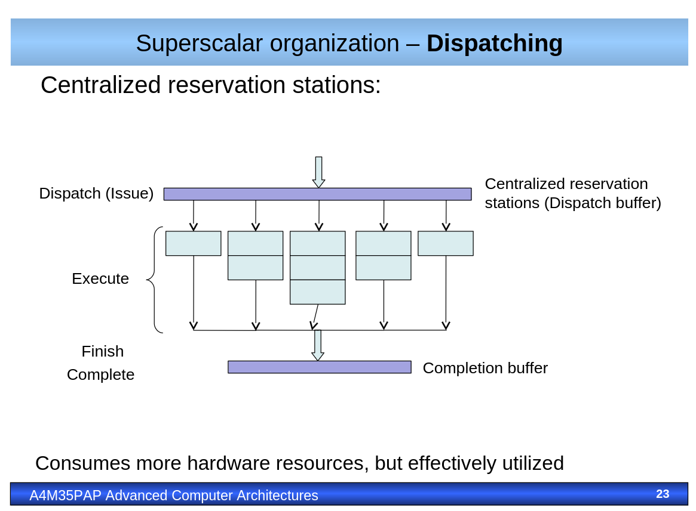  |  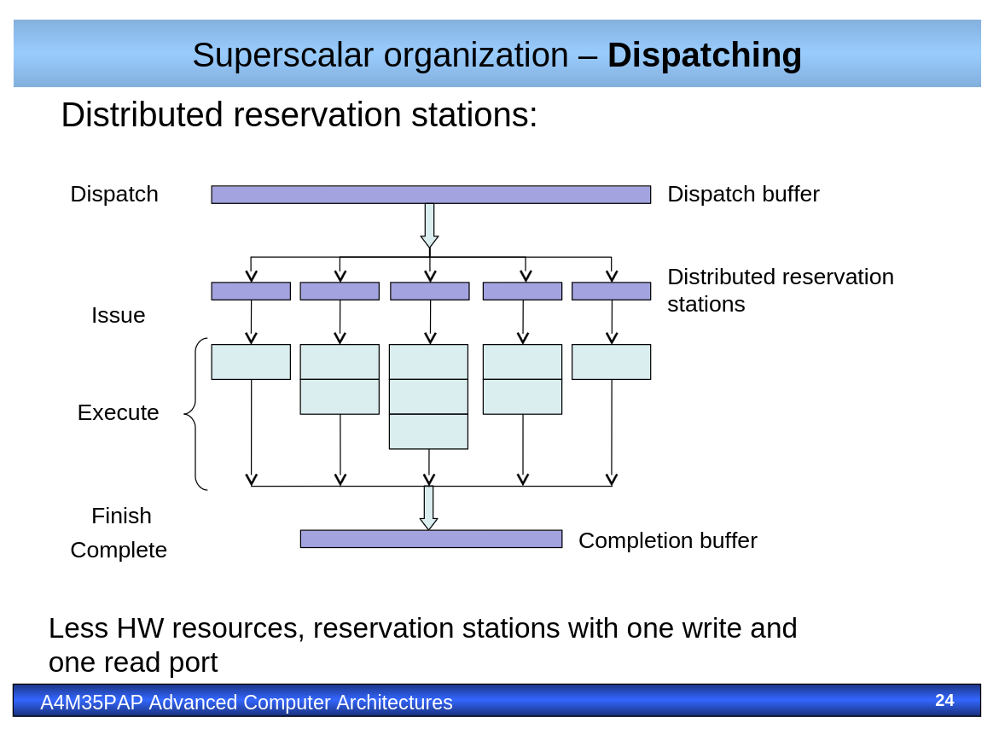

- **Execute** - usually more execution units, than the width of the pipeline. Current trend: more diversified pipelines (in past only Integer operations and Floating point operations were the major ones). More execution units - more complex hardware - need the connections to connect hazard unit to all the execution units for forewarding, reservation stations need monitor for the availability(ready state) or ready operand values(tag matching)\
Best mix of functional units? It depends, usually 2:1:2 ALU:Branch:Load/Store
- **Complete** - instruction is completed, when it finishes execution and updates the machine state. It is when it exits execution unit and enters completion buffer. It can wait another cycles, before it is retired.
- **Retire** - The instruction is retired, when it leaves the completion buffer and updates Data-Cache. 

**Precise exception** support requieres reorder/completion buffer. The Retire of the instructions need to happen in the program order. If the exception occurs, the instruction is tagged. When a tagged instruction is detected, all preceding instructions need to be completed, the the error instruction is not completed and preceding processor state is saved. The following instructions and progress in pipelines is discarded.

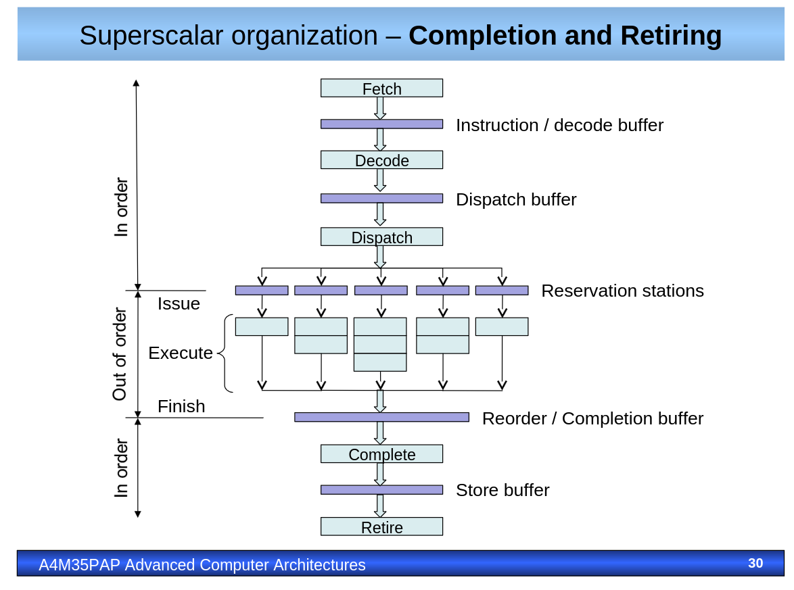

**Tomasulo algorithm**

### 5.2 Relation between memory coherency and consistency, their implementation on systems with shared bus and when multiple rings topologies are used, MESI, MOESI, home directory.

### 5.3 Rules for execution synchronization and data exchange in multiprocessor systems, mutex implementation, relation to consistency models and mechanisms to achieve expected algorithms behavior on systems with relaxed consistency models (PRAM, PSO, TSO, PC, barrier instructions).

### 5.4 SMP and NUMA nodes interconnections networks, conflicts and rearrangeable networks, Beneš network.

### 5.5 Parallel computations on multiprocessor systems, OpenMP on NUMA and MPI on distributed memory systems, their combinations.

## 6. KRP - I/O and network interfaces of computer and embedded systems, hardware and software implementation. 

### 6.1 USB I/O subsystem, structure and functionality of elements, protocol stack, transfer - transaction - packet hierarchy, transfer types and pipes, bandwidth allocation principles, enumeration process and PnP, descriptor hierarchy, USB device implementation.

### 6.2 PCI Express (PCI) I/O subsystems, basic differences and commons of PCI and PCIe, protocol stack, transaction types, packet routing principles, quality of service support, PnP and enumeration process.

### 6.3 Ethernet based networking, VLAN, precision time protocol (PTP), stream reservation protocol (SRP), time sensitive networks (TSN).

### 6.4 In-vehicle networking, Controller Area Network (CAN, CAN-FD), Local Interconnect Network (LIN), FlexRay, data-link layer algorithms, physical topology constraints and relation to system design.

## 7. AVS - ARM based microcontrollers and signal processors; their functionality. Design and implementation of embedded systems for typical application areas.

### 7.1 Typical architecture and main features of ARM based microcontrollers. AMBA. I/O pin configuration. Common used peripheral circuits (I/O ports, timers, DMA controllers, NVIC controller, JTAG, SWD, A/D converters, D/A converters, SPI controllers, I2C controllers, UART, FLASH and SRAM memory).

**AMBA** - *Advanced Microcontroller Bus Architecture* - ARM specific on-chip communication protocols. Different types of AMBA:
- AMBA AXI - *Advanced eXtensible Interface* - high-speed sub-micrometer interconnect. separate address/controll and data phases. Burst based transactions with only start address issued. Older iterations named as ASB - *Advanced system bus*
- AMBA AHB - *Advanced High-performance Bus* - two bus-cycle address phase and data phase. One bus-master at the same time. There is also AHBlight (Only one master in AHB light) [AHB vs AHBlight](http://www.vlsiip.com/amba/ahb/ahb_0002.html)
- AMBA APB - *Advanced Peripheral Bus* - low bandwith controll access, similar to the AHB, but much slower and much simpler communication (for example no bursts)

Source: [AMBA](https://en.wikipedia.org/wiki/Advanced_Microcontroller_Bus_Architecture)

In the stellar SR6P6 the buses are used followingly. The AXI NIX400 crossbar connects the R52 Cores in one cluster with local NVM and RAM. AHB is used to to connect Cortex M4 accelerators domains to their peripherals. NUC can be connected to with either AXI, AHB, AHBLight. The APB is used in peripheral bridge.

If you want to use certain periphery you need to start the corresponding BUS. (which is kinda obvious, but just mentioning it...)

**I/O pin configuration**

GPIO Schema |  Register configuration
:-------------------------:|:-------------------------:
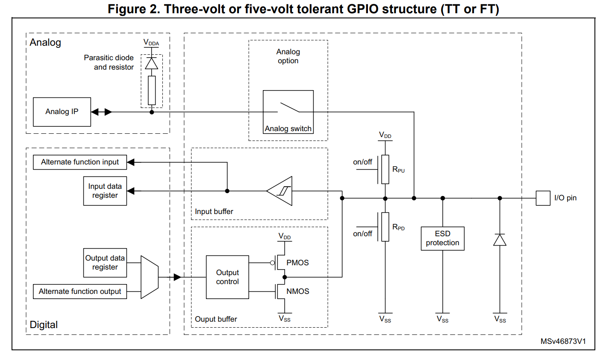 |  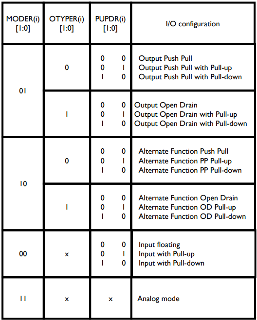

- Mode - Output/Input/Alternate Function/Analog - Alternate function can be UART output, or the TIMER output.
- Push-Pull / OpenDrain - Push-Pull can both provide current and sink current, the OpenDrain only sinks current. 
- Pull-Up / Pull-Down / Floating - Set what is the default state of the pin.

**Timers**

There can be different timers - 16bit, 32bit, HighResolutionTimers (Good for switch-mode power supply)

Useful for PWM, measuring time, Generating interrupts, connecting RotaryEncored, Counting triggers. Capture/Compare and others.

**DMA - direct memory access**

Module used to handle memory manipulation. Can be Periphery-to-Mem, Mem-to-periphery, Mem-to-Mem (And even Periphery to Periphery, but that is special version of the Priphery-to-Mem)

**NVIC - nested vector interrupt controller**

Handles interrupts to the Microcontroller. Enables multiple interrupts to be handeled with the different priority and masking them. There is (as far as I know one unmaskmable interrupt). It is possible to jump to the higher priority interrupt, while executing lower priority interrupt. When interrupt occurs, the processor saves the state of the current routine and executes the higher priority one.

**JTAG + SWD**

Debugging interface standards. 

Jtag requieres 4 signal lines. 

The SWD uses 2-pin interface, that uses the same protocol. Debugger becomes another AMBA busmaster.

Source: [SWJ vs JTAG debugging](https://electronics.stackexchange.com/questions/53571/jtag-vs-swd-debugging)

**A/D + D/A** 

A/D - Analog to Digital converter. The base of the A/D is sampling the analog signal at regular intervals and converting this signal to digital value. About types and the sampling refer to the [7.4 Types of A/D](#74-types-of-ad-converters-sampling-theorem-anti-aliasing-filter-aaf-direct-digital-synthesis-dds). 

D/A - Digital to Analog converter. The base of the D/A convertor in converting the digital value into the Analog signal. 
More info in [7.4 Types of A/D](#74-types-of-ad-converters-sampling-theorem-anti-aliasing-filter-aaf-direct-digital-synthesis-dds). 

**SPI** 

Uses four signals to communicate. Clock, Chip select, MOSI (Master out Slave in), MISO (Master in Slave out). 

Chip select in 0 - communication active. Different SPI modes. Changing the idle state and on which edge (rising/falling) the data will be sampled. Supports FULL-Duplex communication and mupliple slaves by daisychaining them.

**I2C**

Bidirectional, but only Half-Duplex. Master-Slave communication and the bus is Synchronous - clocked with clock signal.
Also can be called TWI (Two-wire interface). One wire is clock, while the other is data. SDA - serial data, SCL - serial clock.

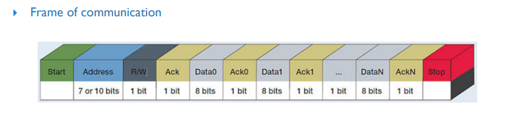

The communication is acknowledged - after every data the receiver acks the received data.

**UART/USART**

UART - universal asynchronous receiver/transmitter. Half-duplex. More simple than USART (Synchronous/asynchronous). Synchronous communication requieres clock signal and that means the communication is a more reliable and can be faster.

UART frame - databits (7,8,9), Optional Parity bit and number of stop bits (1, 1.5, 2)

**FLASH + SRAM**

Flash is non-volatile memory (NVM). Different types, based on the type of manufacturing NOR-FLASH, NAND-FLASH, EEPROM...
NOR-FLASH good random access - good for code storage in micro. NAND flash in consumer electronics, like flash drives. EEPROM electrically erasable programable memory - stable, ideal for external sotrrage for embedded devices.

SRAM (Static Random Access Memory) is a volatile memory. More expensive and faster, than FLASH memory. Used for Cache and TCM. Cana be Synchronous of Asynchronous. Tha fastest RAMs, like in desktop PCs are Synchronous. 

### 7.2 Typical architecture and main features of digital signal processors (DSP). Common used peripheral circuits. Special computational units and their features (ALU, MAC, SHIFT BARREL register, DAG).

DSPs are designed expecially  to efficiently process digital signals in real-time. They are used for application that requiere a lot of data processing, like audio, video, telecommunication, radars...

They are ussualy used with ADC and DAC. Analog data to ADC -> into DSP, carry out some mathematical operations -> DAC -> back to analog signal.

The common peripheral circuits are simillar to the general microcontrollers - gpio, ADC, DAC, Timers, interrupt controllers, power management, DMAs...

DSP typically has Harward architecture - the Instruction and Data memory are separated, as well as the ALU. Has limited instruction set (RISC core). Optimized for dataflow processing directly supported by hardware: circular buffers (FIR), bit reversal (FFT), special instructions for SIMD. Special ALU and MAC units (MAC=Multiply and accumulate)

**ALU** has usual operations (Add sub, div, ++, --, abs, and logical operations AND, OR, XOR...).

**MAC** high speed multiply and accumulate. Multiplication is very important oparatoin in DSP. can have fractional mode 1.15 or integer mode 16.0 (for 16-bit operations). 

**DAG** (Data adress generator) - HW support for circular buffers. 

**Shift barrel register** provides arithmetical and logical shifts. Normalization and even some derivations. 

All the components are highly specialized for the targeted market (Autio, Telecommunication, Sience...)

### 7.3 Digital signal processing: signal spectrum analysis (DFT, IDFT), correlation functions and their typical use, digital filters (FIR, IIR), signal interpolation, signal decimation.

**Impulse characteristic** - system response to the Dirac function

**Transfer characterictic** - system response to the unit step

**DFT**

**IDFT**

### 7.4 Types of A/D converters. Sampling theorem. Anti-aliasing filter (AAF). Direct digital synthesis (DDS).

**Types of A/D converters**
- **Succesive approximation register (SAR) ADC** - defacto binary search. We sample the $V_{in}$. And set the highest bit in DAC to 1. If the $V_{dac}$ is higher than *in* the bit is set to 0, otherwise it stays 1. Move to the less significant bit. This way we will create the value on our DAC, that is closest to the $V_{in}$.\
Intermediete in speed and accuracy.
- **Integrating ADC or Dual slope ADC** - high resolution 12-18 bit. Good accuracy, high stability, low cost. Low sampling rate around 10samples/s. Suitable for slowly changing measurements, like temperature.\
The functionality is described in picture. First the $S_1$ is closed - the charge on the capacitor *C* is zero. Then the $S_2$ is closed for the number of clock cycles N resulting in charge in C. Then the $S_3$ is closed integrating the voltage back to zero, using the negative reference voltage. after time x the charge is 0. Now, knowing the time x, number of clock cycles N and reference voltage, we can count the $V_{in}$ 
- **Paralel ADC or Flash converter** - Like thermometer. Not suitable for high resolution ADCs, but it is very fast. 
- **Charge balancing ADC** - charge balancing integrator. Voltage is translated to the frequency. The pulse is generated when integrated Voltage reaches certain treshold and integrated charge is discharged (depicted as $V_{pulse}$). Number of pulses are counted and that is then translated into the Voltage.\
Input voltage should be lowed than $V_{ref}/2$
- **Sigma-Delta** - engeneer is buying coffee. Based on the oversampling principle. Making many errors and then taking average. 

Synchronous data transfer is usually easier to handle than asynchronous, but it is dependant on the clock frequency - generates jitter. 

SAR DAC | Integrating ADC
|:---:|:--:|
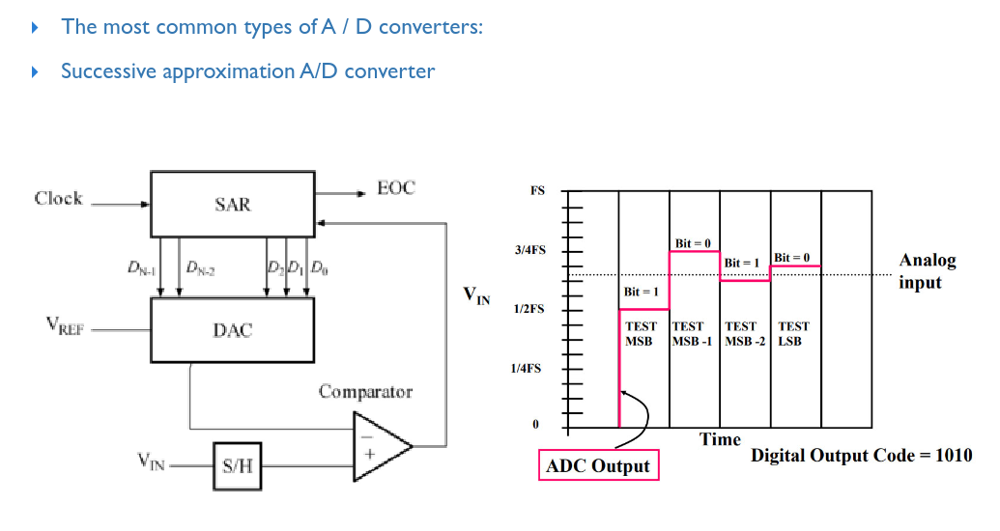|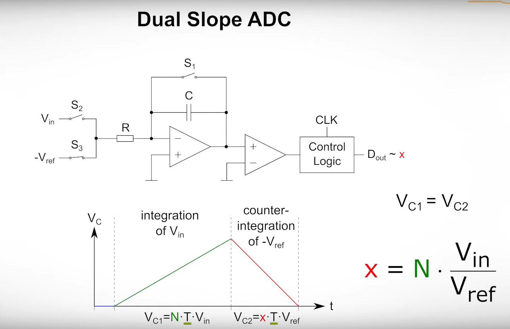

charge balancing | |
|:---:|:--:|
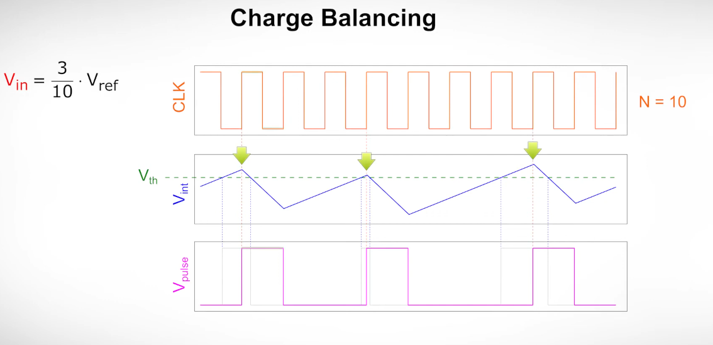|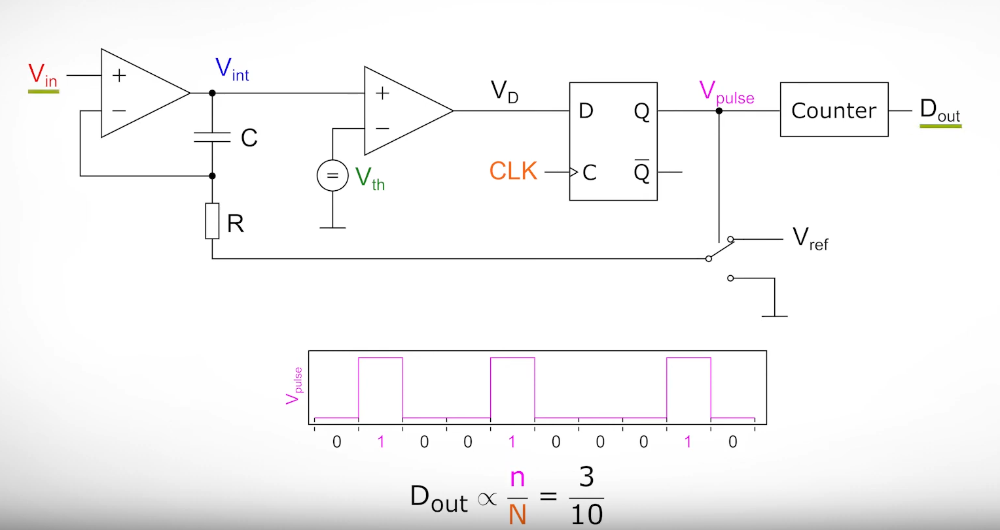

Sigma-delta | Paralel ADC |
|:---:|:--:|
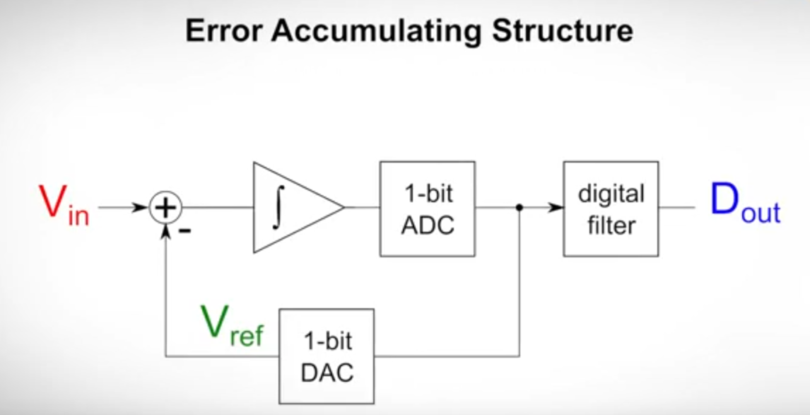|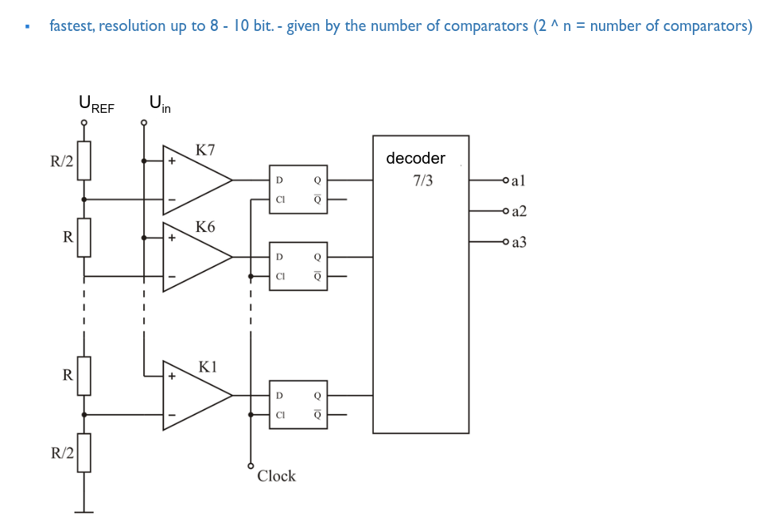

Source [Integrating and charge balancing](https://www.youtube.com/watch?v=f-6shAZL4Ak), [Sigma-Delta](https://www.youtube.com/watch?v=M5Vx-X66seg), [Parallel and SAR](https://www.youtube.com/watch?v=75GcoQ9_LFI)

**Anti-aliasing filter** - also a low-pass filter. When the sampling frequency is lower, than the frequency of the signal we are sampling, we can get garbage. It is important to know this and discard the high frequencies we are not able to reliably capture. For this we use low-pass filter. Only the low frequencies, we know we can represent are sampled, and high frequencies are ignored.
Aliasing |
|:---:|
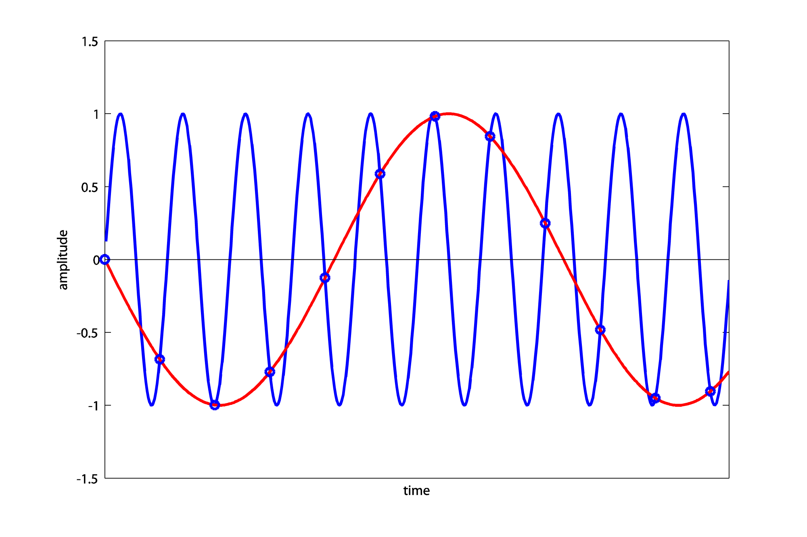|

**Sampling (Shannon-Kotelnik or Nyquist-Shannon) theorem** - Reverse and accurate reconstruction of a continuous frequency signal from discrete values is only possible if the sampling frequency is at least twice higher than the maximum frequency of the reconstructed signal. 

$$
f_{s} > 2f_{sig\_max}
$$
where $f_s$ is sampling frequency and $f_{sig_max}$ is maximum frequency of the signal we try to capture. Nyquist frequency is the $f_{s} \over 2$. Same thing, but isnted of the sampling we tank about frequency.

**DDS - Direct Digital Synthesis** - used to represent some signal stored in memory.

DDS with acumulator rounding|
|:-:|
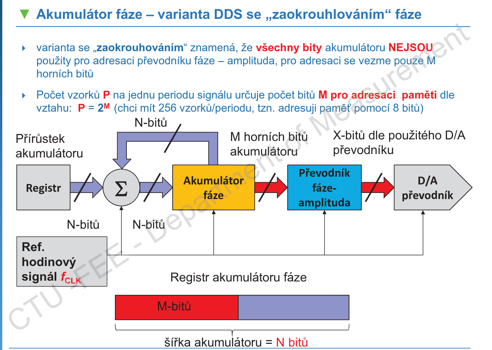|

Register specifies the frequency at which the output signal will be updated. If set to 1 it will be the same as the Reference clock. Acumulator is just sum, that owerflows, once the *Acumulator>size(Lookup_table)* The Converter phase-amplitude is just fancy way of saying lookup table. The acumulator to retrieve value from lookup table and display it on the D/A. 

Difference between rounding and not-rounding DDS is that only the high bits are used to adress the data in lookup table (depends in the size of the table). It is ideal to put low-pass filter after the D/A converter.

One need to keep in mind the Nyquist frequency - the frequency of the outputed signal needs to be lower, than the $f_{clk} \over 2$ but that ususally spawns other frequencies (higher harmonic frequencies) and it is recommend to keep the output frequency at 40%. That being $40\% {f_{clk} \over 2}$

### 7.5 User controls interfacing to microcontrollers (buttons, rotary encoders, graphic LCD, audio codecs, power switches, relays, contactors). Motion control (brush DC motor, stepper motor and brushless DC motor control).

## 8. PAG - Properties of parallel and distributed algorithms. Communication operations for parallel algorithms. Parallel algorithms for linear algebra. BE4M35PAG (Course web pages)

### 8.1 Describe basic communication operations used in parallel algorithms. Show cost analysis of one-to-all broadcast, all-to-all-broadcast, scatter, and all-to-all personalized communication on a ring, mesh, and hypercube. Describe All-Reduce and Prefix-Sum operations and outline their usage.

### 8.2 Describe performance metrics and scalability for parallel systems. How efficiency of a parallel algorithm depends on the problem size and the number of processors? Derive isoefficiency functions of a parallel algorithm for adding numbers (including communication between processors) and explain how it characterizes the algorithm.

### 8.3 Explain and compare two parallel algorithms for matrix-vector multiplication. Describe a parallel algorithm for matrix-matrix multiplication and explain the idea of Cannon’s algorithm. Discuss the principle and properties of the DNS algorithm used for matrix-matrix multiplication.

### 8.4 Outline the principle of sorting networks and describe parallel bitonic sort, including its scalability. Explain parallel enumeration sort algorithm on PRAM model, including its scalability.

### 8.5 Explain all steps of a parallel algorithm for finding connected components in a graph given by the adjacency matrix. Using an example, illustrate a parallel algorithm for finding a maximal independent set in a sparse graph.

## 9. ESW - Effective algorithms and optimization methods. Data structures, synchronization and multithreaded programs.

### 9.1 Java Virtual Machine, memory layout, frame, stack-oriented machine processing, ordinary object pointer, compressed ordinary object pointer. JVM bytecode, Just-in-time compiler, tired compilation, on-stack replacement, disassembler, decompiler. Global and local safe point, time to safe point. Automatic memory Management, generational hypothesis, garbage collectors. CPU and memory profiling, sampling and tracing approach, warm-up phase.

### 9.2 Data races, CPU pipelining and superscalar architecture, memory barrier, volatile variable.  Synchronization - thin, fat and biased locking, reentrant locks. Atomic operations based on compare-and-set instructions, atomic field updaters. Non-blocking algorithms, wait free algorithms, non-blocking stack (LIFO).

### 9.3 Static and dynamic memory analysis, shallow and retained size, memory leak. Data Structures, Java primitives and objects, auto-boxing and unboxing, memory efficiency of complex data structures. Collection for performance, type specific collections, open addressing hashing, collision resolution schemes. Bloom filters, complexity, false positives, bloom filter extensions. Reference types - weak, soft, phantom.

### 9.4 JVM object allocation, thread-local allocation buffers, object escape analysis, data locality, non-uniform memory allocation.

### 9.5 Networking, OSI model, C10K problem. Blocking and non-blocking input/output, threading server, event-driven server. Event-based input/output approaches. Native buffers in JVM, channels and selectors.

### 9.6 Synchronization in multi-threaded programs (atomic operations, mutex, semaphore, rw-lock, spinlock, RCU). When to use which mechanism? Performance bottlenecks of the mentioned mechanisms. Synchronization in “read-mostly workloads”, advantages and disadvantages of different synchronization mechanisms.

### 9.7 Cache-efficient data structures and algorithms (e.g., matrix multiplication). Principles of cache memories, different kinds of cache misses. Self-evicting code, false sharing – what is it and how deal with it?

### 9.8 Profiling and optimizations of programs in compiled languages (e.g., C/C++). Hardware performance counters, profile-guided optimization. Basics of C/C++ compilers, AST, intermediate representation, high-level and low-level optimization passes.
