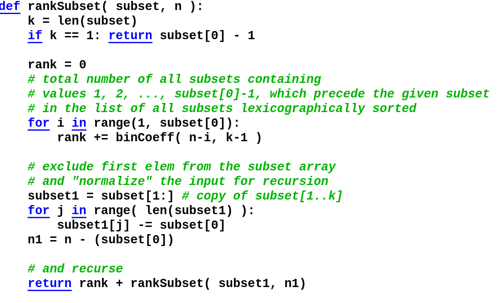
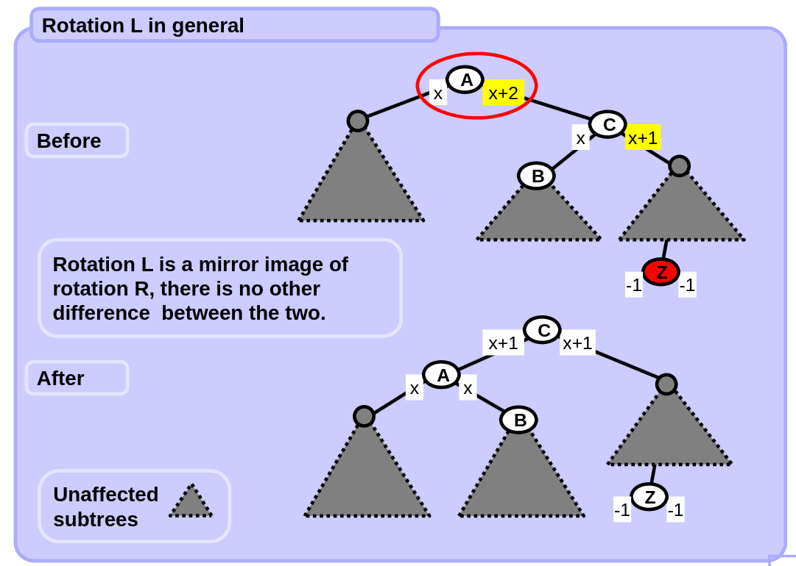
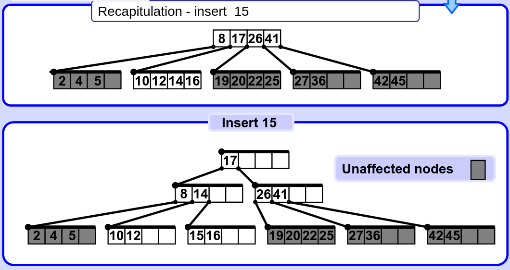
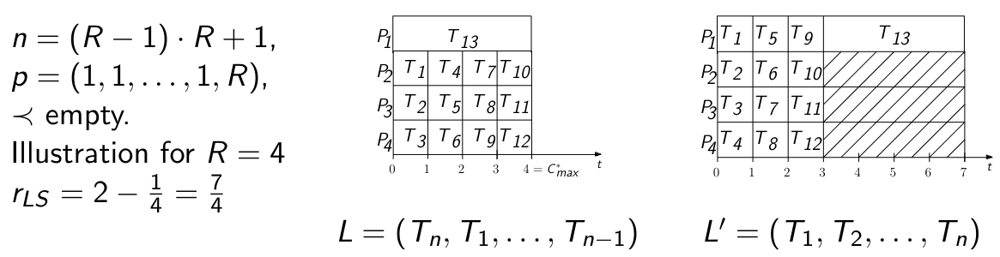
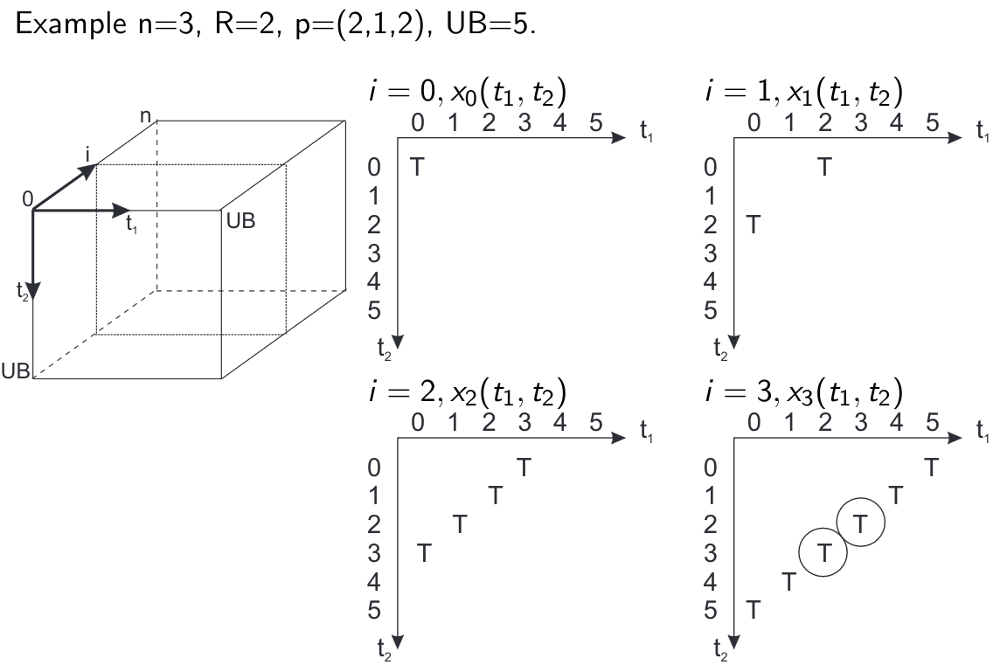
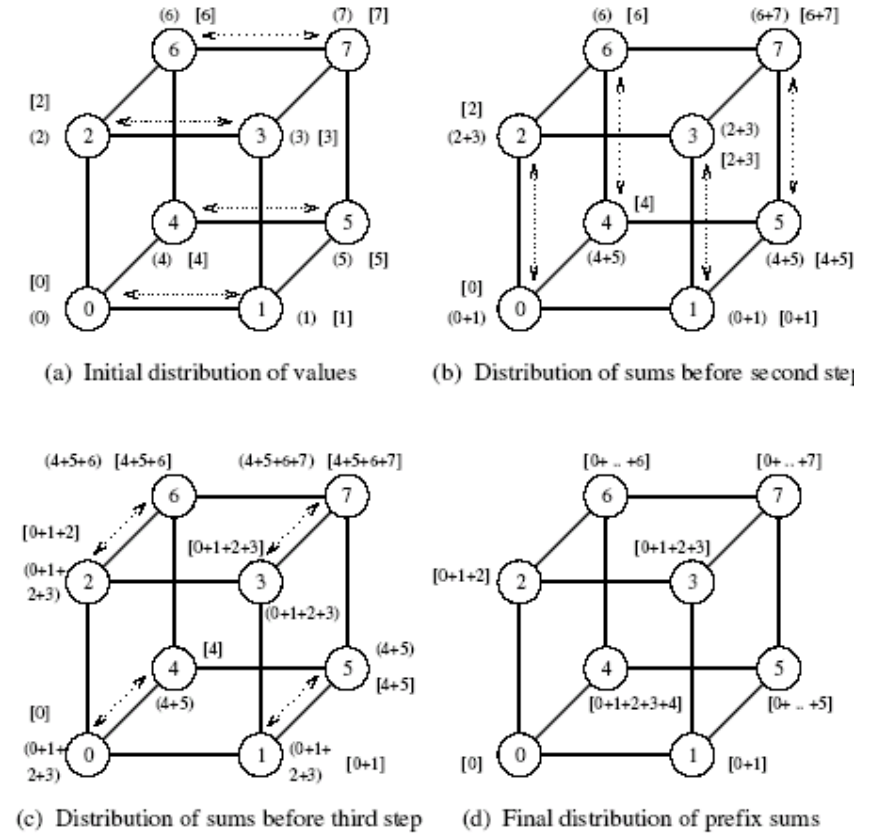

# Final exam place

this repository is for knowledge for final exam of Computer engineering - Open Informatics at CTU FEE Prague

  Contents:

  - [1. PAL - Polynomial algorithms for standard graph problems. Combinatorial and number-theoretical algorithms, isomorphism, prime numbers. Search trees and their use. Text search based on finite automata.](#1-pal---polynomial-algorithms-for-standard-graph-problems-combinatorial-and-number-theoretical-algorithms-isomorphism-prime-numbers-search-trees-and-their-use-text-search-based-on-finite-automata)
    - [x] [1.1 Notation of asymptotic complexity of algorithms. Basic notation of graph problems - degree, path, circuit, cycle. Graph representations by adjacency, distance, Laplacian and incidence matrices. Adjacency list representation.](#11-notation-of-asymptotic-complexity-of-algorithms-basic-notation-of-graph-problems---degree-path-circuit-cycle-graph-representations-by-adjacency-distance-laplacian-and-incidence-matrices-adjacency-list-representation)
    - [x] [1.2 Algorithms for minimum spanning tree (Prim-Jarník, Kruskal, Borůvka), strongly connected components (Kosaraju-Sharir, Tarjan), Euler trail. Union-find problem. Graph isomorphism, tree isomorphism.](#12-algorithms-for-minimum-spanning-tree-prim-jarník-kruskal-borůvka-strongly-connected-components-kosaraju-sharir-tarjan-euler-trail-union-find-problem-graph-isomorphism-tree-isomorphism)
    - [x] [1.3 Generation and enumeration of combinatorial objects - subsets, k-element subsets, permutations. Gray codes. Prime numbers, sieve of Eratosthenes. Pseudorandom numbers properties. Linear congruential generator.](#13-generation-and-enumeration-of-combinatorial-objects---subsets-k-element-subsets-permutations-gray-codes-prime-numbers-sieve-of-eratosthenes-pseudorandom-numbers-properties-linear-congruential-generator)
    - [x] [1.4 Search trees - data structures, operations, and their complexities. Binary tree, AVL tree, red-black tree (RB-tree), B-tree and B+ tree, splay tree, k-d tree. Nearest neighbor searching in k-d trees. Skip list.](#14-search-trees---data-structures-operations-and-their-complexities-binary-tree-avl-tree-red-black-tree-rb-tree-b-tree-and-b-tree-splay-tree-k-d-tree-nearest-neighbor-searching-in-k-d-trees-skip-list)
    - [ ] [1.5 Finite automata, regular expressions, operations over regular languages. Bit representation of nondeterministic finite automata. Text search algorithms - exact pattern matching, approximate pattern matching (Hamming and Levenshtein distance), dictionary automata.](#15-finite-automata-regular-expressions-operations-over-regular-languages-bit-representation-of-nondeterministic-finite-automata-text-search-algorithms---exact-pattern-matching-approximate-pattern-matching-hamming-and-levenshtein-distance-dictionary-automata)
  - [2. TAL - Problem/language complexity classes with respect to the time complexity of their solution and memory complexity including undecidable problems/languages.](#2-tal---problemlanguage-complexity-classes-with-respect-to-the-time-complexity-of-their-solution-and-memory-complexity-including-undecidable-problemslanguages)
    - [ ] [2.1 Asymptotic growth of functions, time and space complexity of algorithms. Correctness of algorithms - variant and invariant.](#21-asymptotic-growth-of-functions-time-and-space-complexity-of-algorithms-correctness-of-algorithms---variant-and-invariant)
    - [ ] [2.2 Deterministic Turing machines, multitape Turing machines, and Nondeterministic Turing machines.](#22-deterministic-turing-machines-multitape-turing-machines-and-nondeterministic-turing-machines)
    - [ ] [2.3 Decision problems and languages. Complexity classes P, NP, co-NP. Reduction and polynomial reduction, class NPC. Cook theorem. Heuristics and approximate algorithms for solving NP complete problems.](#23-decision-problems-and-languages-complexity-classes-p-np-co-np-reduction-and-polynomial-reduction-class-npc-cook-theorem-heuristics-and-approximate-algorithms-for-solving-np-complete-problems)
    - [ ] [2.4 Classes based on space complexity: PSPACE and NPSPACE. Savitch Theorem.](#24-classes-based-on-space-complexity-pspace-and-npspace-savitch-theorem)
    - [ ] [2.5 Randomized algorithms. Randomized Turing machines. Classes based on randomization: RP, ZPP, co-RP.](#25-randomized-algorithms-randomized-turing-machines-classes-based-on-randomization-rp-zpp-co-rp)
    - [ ] [2.6 Decidability and undecidability. Recursive and recursively enumerable languages. Diagonal language. Universal language and Universal Turing machine.](#26-decidability-and-undecidability-recursive-and-recursively-enumerab/le-languages-diagonal-language-universal-language-and-universal-turing-machine)
  - [3. KO - Combinatorial optimization problems - formulation, complexity analysis, algorithms and example applications.](#3-ko---combinatorial-optimization-problems---formulation-complexity-analysis-algorithms-and-example-applications)
    - [x] [3.1 Integer Linear Programming. Shortest paths problem and traveling salesman problem ILP formulations. Branch and Bound algorithm. Problem formulations using ILP. Special ILP problems solvable in polynomial time.](#31-integer-linear-programming-shortest-paths-problem-and-traveling-salesman-problem-ilp-formulations-branch-and-bound-algorithm-problem-formulations-using-ilp-special-ilp-problems-solvable-in-polynomial-time)
    - [x] [3.2 Shortest paths problem. Dijkstra, Bellman-Ford, and Floyd–Warshall algorithms. Shortest paths in directed acyclic graphs. Problem formulations using shortest paths.](#32-shortest-paths-problem-dijkstra-bellman-ford-and-floydwarshall-algorithms-shortest-paths-in-directed-acyclic-graphs-problem-formulations-using-shortest-paths)
    - [x] [3.3 Network flows. Maximum flow and minimum cut problems. Ford-Fulkerson algorithm.  Feasible flow with balances. Minimum cost flow and cycle-canceling algorithm. Problem formulations using network flows. Maximum cardinality matching.](#33-network-flows-maximum-flow-and-minimum-cut-problems-ford-fulkerson-algorithm--feasible-flow-with-balances-minimum-cost-flow-and-cycle-canceling-algorithm-problem-formulations-using-network-flows-maximum-cardinality-matching)
    - [x] [3.4 Knapsack problem. Approximation algorithm, dynamic programming approach, approximation scheme.](#34-knapsack-problem-approximation-algorithm-dynamic-programming-approach-approximation-scheme)
    - [x] [3.5 Traveling salesman problem. Double-tree algorithm and Christofides algorithm for the metric problem. Local search k-OPT.](#35-traveling-salesman-problem-double-tree-algorithm-and-christofides-algorithm-for-the-metric-problem-local-search-k-opt)
    - [x] [3.6 Scheduling - problem description and notation. One resource - Bratley algorithm, Horn algorithm. Parallel identical resources - list scheduling, dynamic programming. Project scheduling with temporal constraints - relative order and time-indexed ILP formulations.](#36-scheduling---problem-description-and-notation-one-resource---bratley-algorithm-horn-algorithm-parallel-identical-resources---list-scheduling-dynamic-programming-project-scheduling-with-temporal-constraints---relative-order-and-time-indexed-ilp-formulations)
    - [x] [3.7 Constraint Satisfaction Problem. AC3 algorithm.](#37-constraint-satisfaction-problem-ac3-algorithm)
  - [4. ISC - Design and implementation of in-chip integrated systems, application specific systems.](#4-isc---design-and-implementation-of-in-chip-integrated-systems-application-specific-systems)
    - [ ] [4.1 Main features and economical aspects of the Application specific integrated circuits systems: full custom design, gate array, standard cells, programmable array logic;](#41-main-features-and-economical-aspects-of-the-application-specific-integrated-circuits-systems-full-custom-design-gate-array-standard-cells-programmable-array-logic)
    - [ ] [4.2 Design principles of mix-signal integrated circuits, purpose of hierarchical design, digital and analogue block interface, CAD design tools for automatic circuit generation; functional and static time analysis, formal verification; Verilog-A, Verilog-AMS, VHDL-A.](#42-design-principles-of-mix-signal-integrated-circuits-purpose-of-hierarchical-design-digital-and-analogue-block-interface-cad-design-tools-for-automatic-circuit-generation-functional-and-static-time-analysis-formal-verification-verilog-a-verilog-ams-vhdl-a)
    - [ ] [4.3 Front end design - functional specification, RTL, logic synthesis, Gate-level netlist, behavioral stimulus extraction.](#43-front-end-design---functional-specification-rtl-logic-synthesis-gate-level-netlist-behavioral-stimulus-extraction)
    - [ ] [4.4 Back End design - specification of Design Kit, Floorplanning, place and route, layout, parasitic extraction, layout versus schema check (LVS).](#44-back-end-design---specification-of-design-kit-floorplanning-place-and-route-layout-parasitic-extraction-layout-versus-schema-check-lvs)
    - [ ] [4.5 Tape out and IC fabrication process, integrated systems verification, scaling and design mapping to different technologies.](#45-tape-out-and-ic-fabrication-process-integrated-systems-verification-scaling-and-design-mapping-to-different-technologies)
  - [5. PAP - Advanced architectures of processors, memory and peripheral circuits and multiprocessor computers.](#5-pap---advanced-architectures-of-processors-memory-and-peripheral-circuits-and-multiprocessor-computers)
    - [x] [5.1 Superscalar techniques used in nodes of multiprocessor systems, data flow inside the processor, Tomasulo algorithm and its deficiencies, precise exceptions support, architectural state, register renaming, reservation station, reorder buffer, instruction fetch, decode, dispatch, issue, execute, finish, complete, reorder, branch prediction, store forwarding, hit under miss.](#51-superscalar-techniques-used-in-nodes-of-multiprocessor-systems-data-flow-inside-the-processor-tomasulo-algorithm-and-its-deficiencies-precise-exceptions-support-architectural-state-register-renaming-reservation-station-reorder-buffer-instruction-fetch-decode-dispatch-issue-execute-finish-complete-reorder-branch-prediction-store-forwarding-hit-under-miss)
    - [x] [5.2 Relation between memory coherency and consistency, their implementation on systems with shared bus and when multiple rings topologies are used, MESI, MOESI, home directory.](#52-relation-between-memory-coherency-and-consistency-their-implementation-on-systems-with-shared-bus-and-when-multiple-rings-topologies-are-used-mesi-moesi-home-directory)
    - [x] [5.3 Rules for execution synchronization and data exchange in multiprocessor systems, mutex implementation, relation to consistency models and mechanisms to achieve expected algorithms behavior on systems with relaxed consistency models (PRAM, PSO, TSO, PC, barrier instructions).](#53-rules-for-execution-synchronization-and-data-exchange-in-multiprocessor-systems-mutex-implementation-relation-to-consistency-models-and-mechanisms-to-achieve-expected-algorithms-behavior-on-systems-with-relaxed-consistency-models-pram-pso-tso-pc-barrier-instructions)
    - [x] [5.4 SMP and NUMA nodes interconnections networks, conflicts and rearrangeable networks, Beneš network.](#54-smp-and-numa-nodes-interconnections-networks-conflicts-and-rearrangeable-networks-beneš-network)
    - [x] [5.5 Parallel computations on multiprocessor systems, OpenMP on NUMA and MPI on distributed memory systems, their combinations.](#55-parallel-computations-on-multiprocessor-systems-openmp-on-numa-and-mpi-on-distributed-memory-systems-their-combinations)
  - [6. KRP - I/O and network interfaces of computer and embedded systems, hardware and software implementation.](#6-krp---io-and-network-interfaces-of-computer-and-embedded-systems-hardware-and-software-implementation)
    - [ ] [6.1 USB I/O subsystem, structure and functionality of elements, protocol stack,transfer - transaction - packet hierarchy, transfer types and pipes, bandwidth allocation principles, enumeration process and PnP, descriptor hierarchy, USB device implementation.](#61-usb-io-subsystem-structure-and-functionality-of-elements-protocol-stacktransfer---transaction---packet-hierarchy-transfer-types-and-pipes-bandwidth-allocation-principles-enumeration-process-and-pnp-descriptor-hierarchy-usb-device-implementation)
    - [ ] [6.2 PCI Express (PCI) I/O subsystems, basic differences and commons of PCI and PCIe, protocol stack, transaction types, packet routing principles, quality of service support, PnP and enumeration process.](#62-pci-express-pci-io-subsystems-basic-differences-and-commons-of-pci-and-pcie-protocol-stack-transaction-types-packet-routing-principles-quality-of-service-support-pnp-and-enumeration-process)
    - [ ] [6.3 Ethernet based networking, VLAN, precision time protocol (PTP), stream reservation protocol (SRP), time sensitive networks (TSN).](#63-ethernet-based-networking-vlan-precision-time-protocol-ptp-stream-reservation-protocol-srp-time-sensitive-networks-tsn)
    - [ ] [6.4 In-vehicle networking, Controller Area Network (CAN, CAN-FD), Local Interconnect Network (LIN), FlexRay, data-link layer algorithms, physical topology constraints and relation to system design.](#64-in-vehicle-networking-controller-area-network-can-can-fd-local-interconnect-network-lin-flexray-data-link-layer-algorithms-physical-topology-constraints-and-relation-to-system-design)
  - [7. AVS - ARM based microcontrollers and signal processors; their functionality. Design and implementation of embedded systems for typical application areas.](#7-avs---arm-based-microcontrollers-and-signal-processors-their-functionality-design-and-implementation-of-embedded-systems-for-typical-application-areas)
    - [x] [7.1 Typical architecture and main features of ARM based microcontrollers. AMBA. I/O pin configuration. Common used peripheral circuits (I/O ports, timers, DMA controllers, NVIC controller, JTAG, SWD, A/D converters, D/A converters, SPI controllers, I2C controllers, UART, FLASH and SRAM memory).](#71-typical-architecture-and-main-features-of-arm-based-microcontrollers-amba-io-pin-configuration-common-used-peripheral-circuits-io-ports-timers-dma-controllers-nvic-controller-jtag-swd-ad-converters-da-converters-spi-controllers-i2c-controllers-uart-flash-and-sram-memory)
    - [x] [7.2 Typical architecture and main features of digital signal processors (DSP). Common used peripheral circuits. Special computational units and their features (ALU, MAC, SHIFT BARREL register, DAG).](#72-typical-architecture-and-main-features-of-digital-signal-processors-dsp-common-used-peripheral-circuits-special-computational-units-and-their-features-alu-mac-shift-barrel-register-dag)
    - [ ] [7.3 Digital signal processing: signal spectrum analysis (DFT, IDFT), correlation functions and their typical use, digital filters (FIR, IIR), signal interpolation, signal decimation.](#73-digital-signal-processing-signal-spectrum-analysis-dft-idft-correlation-functions-and-their-typical-use-digital-filters-fir-iir-signal-interpolation-signal-decimation)
    - [x] [7.4 Types of A/D converters. Sampling theorem. Anti-aliasing filter (AAF). Direct digital synthesis (DDS).](#74-types-of-ad-converters-sampling-theorem-anti-aliasing-filter-aaf-direct-digital-synthesis-dds)
    - [x] [7.5 User controls interfacing to microcontrollers (buttons, rotary encoders, graphic LCD, audio codecs, power switches, relays, contactors). Motion control (brush DC motor, stepper motor and brushless DC motor control).](#75-user-controls-interfacing-to-microcontrollers-buttons-rotary-encoders-graphic-lcd-audio-codecs-power-switches-relays-contactors-motion-control-brush-dc-motor-stepper-motor-and-brushless-dc-motor-control)
  - [8. PAG - Properties of parallel and distributed algorithms. Communication operations for parallel algorithms. Parallel algorithms for linear algebra.](#8-pag---properties-of-parallel-and-distributed-algorithms-communication-operations-for-parallel-algorithms-parallel-algorithms-for-linear-algebra-be4m35pag-course-web-pages)
    - [x] [8.1 Describe basic communication operations used in parallel algorithms. Show cost analysis of one-to-all broadcast, all-to-all-broadcast, scatter, and all-to-all personalized communication on a ring, mesh, and hypercube. Describe All-Reduce and Prefix-Sum operations and outline their usage.](#81-describe-basic-communication-operations-used-in-parallel-algorithms-show-cost-analysis-of-one-to-all-broadcast-all-to-all-broadcast-scatter-and-all-to-all-personalized-communication-on-a-ring-mesh-and-hypercube-describe-all-reduce-and-prefix-sum-operations-and-outline-their-usage)
    - [x] [8.2 Describe performance metrics and scalability for parallel systems. How efficiency of a parallel algorithm depends on the problem size and the number of processors? Derive isoefficiency functions of a parallel algorithm for adding numbers (including communication between processors) and explain how it characterizes the algorithm.](#82-describe-performance-metrics-and-scalability-for-parallel-systems-how-efficiency-of-a-parallel-algorithm-depends-on-the-problem-size-and-the-number-of-processors-derive-isoefficiency-functions-of-a-parallel-algorithm-for-adding-numbers-including-communication-between-processors-and-explain-how-it-characterizes-the-algorithm)
    - [x] [8.3 Explain and compare two parallel algorithms for matrix-vector multiplication. Describe a parallel algorithm for matrix-matrix multiplication and explain the idea of Cannon’s algorithm. Discuss the principle and properties of the DNS algorithm used for matrix-matrix multiplication.](#83-explain-and-compare-two-parallel-algorithms-for-matrix-vector-multiplication-describe-a-parallel-algorithm-for-matrix-matrix-multiplication-and-explain-the-idea-of-cannons-algorithm-discuss-the-principle-and-properties-of-the-dns-algorithm-used-for-matrix-matrix-multiplication)
    - [x] [8.4 Outline the principle of sorting networks and describe parallel bitonic sort, including its scalability. Explain parallel enumeration sort algorithm on PRAM model, including its scalability.](#84-outline-the-principle-of-sorting-networks-and-describe-parallel-bitonic-sort-including-its-scalability-explain-parallel-enumeration-sort-algorithm-on-pram-model-including-its-scalability)
    - [x] [8.5 Explain all steps of a parallel algorithm for finding connected components in a graph given by the adjacency matrix. Using an example, illustrate a parallel algorithm for finding a maximal independent set in a sparse graph.](#85-explain-all-steps-of-a-parallel-algorithm-for-finding-connected-components-in-a-graph-given-by-the-adjacency-matrix-using-an-example-illustrate-a-parallel-algorithm-for-finding-a-maximal-independent-set-in-a-sparse-graph)
  - [9. ESW - Effective algorithms and optimization methods. Data structures, synchronization and multithreaded programs.](#9-esw---effective-algorithms-and-optimization-methods-data-structures-synchronization-and-multithreaded-programs)
    - [ ] [9.1 Java Virtual Machine, memory layout, frame, stack-oriented machine processing, ordinary object pointer, compressed ordinary object pointer. JVM bytecode, Just-in-time compiler, tired compilation, on-stack replacement, disassembler, decompiler. Global and local safe point, time to safe point. Automatic memory Management, generational hypothesis, garbage collectors. CPU and memory profiling, sampling and tracing approach, warm-up phase.](#91-java-virtual-machine-memory-layout-frame-stack-oriented-machine-processing-ordinary-object-pointer-compressed-ordinary-object-pointer-jvm-bytecode-just-in-time-compiler-tired-compilation-on-stack-replacement-disassembler-decompiler-global-and-local-safe-point-time-to-safe-point-automatic-memory-management-generational-hypothesis-garbage-collectors-cpu-and-memory-profiling-sampling-and-tracing-approach-warm-up-phase)
    - [ ] [9.2 Data races, CPU pipelining and superscalar architecture, memory barrier, volatile variable.  Synchronization - thin, fat and biased locking, reentrant locks. Atomic operations based on compare-and-set instructions, atomic field updaters. Non-blocking algorithms, wait free algorithms, non-blocking stack (LIFO).](#92-data-races-cpu-pipelining-and-superscalar-architecture-memory-barrier-volatile-variable--synchronization---thin-fat-and-biased-locking-reentrant-locks-atomic-operations-based-on-compare-and-set-instructions-atomic-field-updaters-non-blocking-algorithms-wait-free-algorithms-non-blocking-stack-lifo)
    - [ ] [9.3 Static and dynamic memory analysis, shallow and retained size, memory leak. Data Structures, Java primitives and objects, auto-boxing and unboxing, memory efficiency of complex data structures. Collection for performance, type specific collections, open addressing hashing, collision resolution schemes. Bloom filters, complexity, false positives, bloom filter extensions. Reference types - weak, soft, phantom.](#93-static-and-dynamic-memory-analysis-shallow-and-retained-size-memory-leak-data-structures-java-primitives-and-objects-auto-boxing-and-unboxing-memory-efficiency-of-complex-data-structures-collection-for-performance-type-specific-collections-open-addressing-hashing-collision-resolution-schemes-bloom-filters-complexity-false-positives-bloom-filter-extensions-reference-types---weak-soft-phantom)
    - [ ] [9.4 JVM object allocation, thread-local allocation buffers, object escape analysis, data locality, non-uniform memory allocation.](#94-jvm-object-allocation-thread-local-allocation-buffers-object-escape-analysis-data-locality-non-uniform-memory-allocation)
    - [ ] [9.5 Networking, OSI model, C10K problem. Blocking and non-blocking input/output, threading server, event-driven server. Event-based input/output approaches. Native buffers in JVM, channels and selectors.](#95-networking-osi-model-c10k-problem-blocking-and-non-blocking-inputoutput-threading-server-event-driven-server-event-based-inputoutput-approaches-native-buffers-in-jvm-channels-and-selectors)
    - [ ] [9.6 Synchronization in multi-threaded programs (atomic operations, mutex, semaphore, rw-lock, spinlock, RCU). When to use which mechanism? Performance bottlenecks of the mentioned mechanisms. Synchronization in “read-mostly workloads”, advantages and disadvantages of different synchronization mechanisms.](#96-synchronization-in-multi-threaded-programs-atomic-operations-mutex-semaphore-rw-lock-spinlock-rcu-when-to-use-which-mechanism-performance-bottlenecks-of-the-mentioned-mechanisms-synchronization-in-read-mostly-workloads-advantages-and-disadvantages-of-different-synchronization-mechanisms)
    - [ ] [9.7 Cache-efficient data structures and algorithms (e.g., matrix multiplication). Principles of cache memories, different kinds of cache misses. Self-evicting code, false sharing – what is it and how deal with it?](#97-cache-efficient-data-structures-and-algorithms-eg-matrix-multiplication-principles-of-cache-memories-different-kinds-of-cache-misses-self-evicting-code-false-sharing--what-is-it-and-how-deal-with-it)
    - [ ] [9.8 Profiling and optimizations of programs in compiled languages (e.g., C/C++). Hardware performance counters, profile-guided optimization. Basics of C/C++ compilers, AST, intermediate representation, high-level and low-level optimization passes.](#98-profiling-and-optimizations-of-programs-in-compiled-languages-eg-cc-hardware-performance-counters-profile-guided-optimization-basics-of-cc-compilers-ast-intermediate-representation-high-level-and-low-level-optimization-passes)

## 1. PAL - Polynomial algorithms for standard graph problems. Combinatorial and number-theoretical algorithms, isomorphism, prime numbers. Search trees and their use. Text search based on finite automata.

### 1.1 Notation of asymptotic complexity of algorithms. Basic notation of graph problems - degree, path, circuit, cycle. Graph representations by adjacency, distance, Laplacian and incidence matrices. Adjacency list representation.

**Notation of asymptotic complexity of algorithms**

There are three main notations for asymptotic complexity. 
1) Asymptotic upper bound $f(x) \in O(g(x))$ if the value of the function f is on or below the value of the function g.
2) Asymptotic lower bound $f(x)  \in \Omega(g(x))$ if the value of the function f is on or above the value of the function g.
3) Asymptotic tight bound $f(x) \in \Theta(g(x))$ if the value of the function f is equal to the value of the function g.

More in depth described in [TAL 2.1](#21-asymptotic-growth-of-functions-time-and-space-complexity-of-algorithms-correctness-of-algorithms---variant-and-invariant)

**Basic notation of graph problems**
- **Degree** is the property of the vertex. It symbolizes, how many edges are incident (are connected) to a given node. For directed graph these edges are further divided into **indegree** ($deg^+$) and **outdegree** ($deg^-$). The indegree symbolizes the number of edges, that have the node as destination, and outdegree as starting-point.

Degree - Undirected| Degree - Directed|
|:-:|:-:|
|

Handshaking lemma: sum of all degrees in graph is 2x number of Edges. 

$$\sum_{v\in V} deg(v) = 2|E|$$

**Complete Graph** - graph where every node is directry connected to all other nodes.

**Path** - sequence of vertices and edges, where all **vertices differ** from each other. Hamiltonian path visites every vertex. Hamiltonian cycle in addition to that starts and ends in the same node.

**Trail** - sequence of vertices and edges, where all **edges differ** from each other. Eulerian trail visites every edge exactly once (domeček jedním tahem). Eulerian circuit starts and ends in the same node.

**Circuit** - closed path (starts and ends in the same vertex)

**Cycle** - the cycle is the same as circuit, but the edges and verteces can repeat.

**Connected graph** is graph where exists path between all verteces.

**Three** is connected graph, where every two vertices are connected by just one path. 

**Adjecency matrix** is matrix, where $a_{i,j} = \begin{cases} 1& \text{for } \{v_i, v_j\} \in E \\ 0& \text{otherwise}\end{cases}$. The *1* in the field *i,j* symbolises weather the nodes *i* and *j* are connected.

**Laplacian matrix** is matrix where $l_{i,j} = \begin{cases} deg(v_i)& \text{for } i=j\\ -1& \text{for } \{v_i, v_j\} \in E\\ 0& \text{otherwise}\end{cases}$. On the diagonal are degrees of the nodes, and each pair of nodes *i,j* that is connected is represented by -1 in the matrix. Note, that sum of row, or column is always 0.

**Distance matrix** is simmiral to adrecency matrix, but instead the plain 1, there is cost of the edge insead - question is what happens when two vertexes dont have common edge, but they are connected with path. The notation is not unified.

**Incidence matrix** the matrix has $V\times N$ dimensions. Where each column symbolizes each vertex, in each column there is -1 and 1. The -1 symbolizes start node of the edge and 1 symbolizes the end node of the edge. $(I)_{i,j}=\begin{cases} -1& \text{for } e_j = (v_i, *)\\ +1& \text{for } e_j = (*, v_i)\\ 0& \text{otherwise}\end{cases}$

**Adjacency list** (list of neighbours) - each node keeps track of the neighbouring nodes. 

For sparse graphs the adjacency list is usually faster. Only good thing about matricies is when we want to remove edge, it is pretty easy.

### 1.2 Algorithms for minimum spanning tree (Prim-Jarník, Kruskal, Borůvka), strongly connected components (Kosaraju-Sharir, Tarjan), Euler trail. Union-find problem. Graph isomorphism, tree isomorphism.

**Prim-Jarník** - greedy MST algorithm, always choose the best edge and add it, until all vertices are added.
Rough algorithm: 
1) Create priority queue and set. Choose random vertex from the graph, add the vertex to the set, and it's edges to the priority queue, the cost of the edge symbolises priority.
2) Pop edge from queue. Check check if the destination is in the set. If not, add the vertex to the set and its vertices to the priority queue. Otherwise repeat 2)
3) repeat until all vertices are in set.

**Kruskal** - always adds lowest cost edge to the graph, if it does not create any cycle. Uses union-find structure. Rough Algorithm:
1) Sort edges and add them to queue. Create set for vertices.
2) Pop edge from queue, if it does not create cirle, add the vertices to the set. Otherwise repeat 2)
3) repeat until all vertices are in set

**Borůvka** - starts with unconnected graph of components. Iteratively from each component choose the cheapest out-edge and merge with the connected component. Rough algorithm:
1) Each vertex is each own component. Create structure for storing edges.
2) For each component, choose the cheapest out-facing edge and add it to the edges. Merge the two connected components.
3) Repeat until there is only one component.

**Union-find** the union find structure provides two operations: **FIND(v)** returns the representative of the connected component the **v** is member. **UNION(u,v)** merges two components together.

This is achieved by each node storing pointer to the representative of the component. The representative can be identified by having this pointer NULL. Two vertices return the same value from FIND, if they are in the same component. The union is executed by finding roots and then adding one as the parent of the other.

When we call FIND on the vertex, and the dirrect parent is not root, we can modify the pointer to point directry to the root in order to speed up following FINDs.

**Kosaraju-Sharir** - algorithm finds strongly connected components in the directed graph. Rough algorithm:
1) Create stack for nodes.
2) Choose random unvisited node. Do recursively DFS, if the node does not have any unvisited neighbours, close the node and add it to the stack. 
3) Repeat 2) until all nodes are in stack.
4) Reverse edges.
5) Pop vertex from stack if it is not closed do recursive DFS. The returned set of verticies by the DFS is strongly connected component. Close the verticies in the component.
6) Repeat 5) until stack is empty.

If the graph is represented by adjecency list, the algorithm runs in linear time, if the adjacency matrix is used, the algorithm runs in $O(n^2)$ time.

**Tarjan** - algorithm, that finds strongly connected components, in contrast to the Kosaraju-Sharir algorithm, the Tarjan algorithm, only needs to go trough the graph once. Rough algorithm:

1) Create Stack for nodes.
2) Choose random node, set lowlink to the value of the vertex index and push the vertex to the stack. Go trough children. If unvisited call 2) on them, if child is instack, update the local lowlink to the minimum of the two lowlinks.
3) If lowlink == ID -> head of the Super Connected component -> pop vertexes from stack, until the head is popped as well. Return popped vertecies, as the strongly connected component.

**Euler trail** the graph has Euler trail iff it is connected and has 1 or 2 verticies of odd edge. To have Eulerian tour (start and end in the same vertex) every vertex must have even degree. For Euler path, the start and end must have odd, rest even degree (Domeček jedním tahem se musí začít od podlahy).
The basic algorithm:
```
fn euler_trail(v: Vertex) {
  for u in v.children {
    remove edge(v,u) from graph;
    euler_trail(u);
    push(edge(v,u));
  }
}
```

**Graph Isomorphism** - NP-complete proble. We can only use cleaver approach, but some graphs (mainly almost regular graphs) are unsolvable in polynomial time. 

When comparing graphs *g* and *g'* we can compare the graphs. Do they have same number of vertexes? Do the vertexes have same degree?... The main principle is to create mapping for graph *g* which when compared to the *g'* is identical. During mapping we can use cleaver approaches only to map the nodes with certain degree to the nodes of the certain degree. And we can also check if the neighbours have the same degree...

**Isomorphism for trees** is done creating tree certificate. Each vertex has at the beginning 01 and we cerursively from the leaves put the children inside our 01. The tree can be recreated by following the certificate - the 0 is down, create node, 1 is up. The example is in the Tree Certificate picture.

Tree Certificate|
|:-:|


### 1.3 Generation and enumeration of combinatorial objects - subsets, k-element subsets, permutations. Gray codes. Prime numbers, sieve of Eratosthenes. Pseudorandom numbers properties. Linear congruential generator.

**Subsets** 

The main terms used are *ranking function* -> function that gives a subset its number. There is also UNRANK which is inverse function to the RANK

$$\text{rank: } S\to \{0, ... , |S|-1\}$$

The $S$ is finite set. We also define the *successor* function, which satisfies:

$$\text{successor(s)} = t \iff \text{rank(t)} = \text{rank(s)} + 1$$

The succesor has rank increased by one.

These functions are useful when storing combinatorial objects (we only need to store the RANK) and when generating random objects from $S$, ensuring equal probability $1\over|S|$

The *Characteristic vector* is one dimensional binary array. Let $T \subseteq S$. The characteristic vector of T symbolises which elements of S are in the T.

$$\chi(T) = [x_{n-1}, x_{n-2}, ... , x_0]$$

where

$$x_i = \begin{cases} 1& \text{if } (n-i) \in T\\ 0& \text{if } (n-i) \notin T \end{cases}$$

Characteristic Vector and RANK example|
|:-:|


Notice that the 0s and 1s in the *Characteristic vector* correspond to the binary representation of RANK.

**k-element subsets**

Suppose n is positive integer $S = \{1, ... , n\}$ then $\binom{S}{k}$ consists of all *k-element subsets* of $S$

To generate all k-element subset, we can use recursion. We set the first element, and then generate k-1 element subset...

To RANK the k-element subset, we count the previous subsets. Lets say we have subset {5,6,10}, which was taken from the Set $S = \{1, 2, 3, ... , 10\}$. The lowest number on our subset is 5 - that means all subsets starting with 1, 2, 3 and 4 are before our subset. To get the sum of all those we can use Combinatioral numbers. To get all subsets starting with 1 we can compute $\binom{|S|-1}{2}$ -> the size of Set minus 1 (we decided thet the first number is 1, so we cannot choose it again) and we choose only two additional numbers, since the first *1* is allready chosen. Twis way we can iteratively compute the number for subsets starting with 2 $\binom{|S|-2}{2}$ (we use |S|-2 since we cannot use 1, or 2. Subsets containing 1 or 2 were included by the *1*)...

We can do described approach recursively for the lower rank digits, the digits 6 and 10.

To compute the RANK of subset {5,6,10} taken from set S we compute:

$$\overbrace{\binom{10-1}{2} + \binom{10-2}{2} + \binom{10-3}{2} + \binom{10-4}{2}}^\text{Subsets starting with 1, 2, 3, 4} = 194$$

Now we know the number of subsets before {5,x,x}. Now to resolve {5,6,x} -> the 6 is the first of the subsets, that means the following number shows the rank: 10. We normalize it by subtracting the 6 = 4;

That means 

$$RANK(\{5,6,10\}) = 198$$

If the number was bigger thank 6 ->lets say the k-subset was {5, 8, 9} the first sum would be same, but since 8 is not first number after 5, we would need to compute number of subsets starting with {5,6,x}, and {5,7,x} -> that is the same as choosing {6,x} and {7,x} from {6,7,8,9,10}, can be normalized to {1,x}, {2,x} from {1,2,3,4,5}. -> $\binom{5-1}{1}+\binom{5-2}{1}$

And +1, since the 9 is the first x in the {5,8,x} k-subset. That means

$$RANK(\{5,8,9\}) = 202$$

The code is in the *k-element subset RANK* picture.

K-element subset RANK |
|:-:|
|

UNRANK is similar. I have rank, and I try to subtract the combinatorial values. When I overflow, I step back and set to subtracting recursively smaller subsets, until the remainder is exactly zero.

**permutations**

Permutations idea is very similar to the k-element subset. Only now we work with factorials $n!$ instead of combinations.

**Gray codes**

Gray code is the code, where two consecutive numbers differ in only one bit.

The lemma:

Suppose
- $0 \leq r \leq 2^n-1$
- $B = n_{n-1},...,b_0$ is binary code for r
- $G = g_{n-1},...,g_0$ is Gray code for r 

For every $j\in \{0,1,...,n-1\}$

$$g_j = (b_j + b_j+1) \mod 2$$

This lemma can be proven by induction. From that we can create functions to convert between Binary and Gray representation. The rust-like pseudocode is used for the example code.

Binary to Gray:

```rust
fn BtoG(B: u32) -> u32 {
    B xor (B>>1)
}
```
Gray to Binary:

```rust
fn GtoB (G: u32) -> u32 {
    let mut B = 0;
    let n = G.bits.len-1;
    for i in 0..n {
        B = B << 1;
        B = B or (1 and ((B >> 1) xor (G>>n)));
        G = G << 1;
    }
    B
}
```

**Sieve of Eratosthenes**

Table for finding prime numbers. The table contains all numbers 1-n. 
1) Create table full of numbers 1..n
2) Iterate trough numbers, if the number *a* is *unused* store it as a Prime number. And go trough the table and mark every number that is multiply of *a* as used. (They are on the table indexes i $i\mod a = 0$)
3) when the $\sqrt n$ index is reached, all the remaining *unused* numbers are all primes.

**Pseudorandom number properties**

The pseudorandom is not entirely random, since it is generated by deterministic algorithm. It satisfies two conditions: 
1) Local unpredictability (without knowing the internal structure of PC or algorithm, the output looks random)
2) Statistical tests confirm the random behaviour.

Peudorandom generators neet two important statistical properties:
- Uniformity
- Independence\
Random number in a interval [a,b] must be independently drawn from a uniform distribution with probalibilty density function: 

$$f(x) = \begin{cases} {1\over b-a}& x\in [a,b]\\ 0& \text{elsewhere}\end{cases}$$

in interval [a,b] is long enough, period is b-a, generates all integers in [a,b]  

To generate random float numbers in an interval [0,1) we can use the integer generator generating [a,b] integers. The float sequence can be generated using:

$$\{y_n\} = \bigg\{{x_n-a\over b-a-1}\bigg\}$$

When the interval is normalized -> [0, c] the formula can be simplified, by tossiong out a and substituing b with c.

[a,b] = [0,512]

$${x_n} = \{41, 301, 139, ...\}$$
$${y_n} = \bigg\{{41\over511}, {301\over511}, {139\over511}, ...\bigg\}$$

With the large enough b the fractions will be fine enough.

**Linear congruention generator**

Linear congruent generator produces ${x_n}$ defined by relations

$$0 \leq x_0 \leq M$$
$$x_{n+1} = (Ax_n+C)\mod M; n \geq 0$$

Modulus $M$, seed $x_0$ multiplier and increment $A$, $C$ 

To gain the maximum period length (equal to the M), the conditions of Hull-Dorbell theorem must be met:
1) *C* and *M* are coprimes
2) *A-1* is divisible by each prime factor of *M*
3) If *4* divides *M*, then also *4* divides *A-1*

Integers *a* and *b* are coprimes, iff their only common devisor is 1. The numbers 4 and 9 arent prime numbers, but are coprimes. 

### 1.4 Search trees - data structures, operations, and their complexities. Binary tree, AVL tree, red-black tree (RB-tree), B-tree and B+ tree, splay tree, k-d tree. Nearest neighbor searching in k-d trees. Skip list.
 
 **Binary tree** - for each node in the tree it holds, that smaler key values are held on the left, higher on the right. The tree does not have to be balanced. We can go through tree INORDER to obtain the sorted key list. The tree provides operations:
 - Find - find is binary search complexity $\log n$
 - Insert - insert is also $\log n$ find the vertex with free spot, that is closest to my number, and link it. 
 - Delete - also $\log n$ remove the key. If it was **childrenless** node - no more work requiered. If it had **one child**, pair that child with the parent. If it had **two children** then traverse the tree for finding either leftmost on the right, or rightmost on the left and put it in the place of deleted value.

 **AVL tree** - it is similar to the binary tree, as it has also Find, Insert and Delete operations, but the difference is, that AVL tree has additional properties to keep it reasonably balanced.

 Each node keeps track of the depth of the left and right tree. The difference between the two depths can be at most one. (Depth of an empty tree is -1)

 The operations Insert and Delete apply apropriate rotations if the balancing depths conditions are not met.

 The rotations are R, L, RL, and LR. The rotations R and L are used if the *outer child* is causing the disbalance the RL and LR rotations are used when *inner child* causes the disbalance

Rotation L | Rotation R
|:-:|:-:|
|

The L and R rotation just swaps the root and the overweight child, passing one child to the old root.

Rotation LR | Rotation RL
|:-:|:-:|
|

The LR and RL swaps the node with the root, the root is pushed on the side. Now orphant trees of the new root are given to the old parent and old root.

**RB tree** - special type of Binary obeying following rules:
1) The node is either red or black. 
2) The ROOT and NIL leaves are black. 
3) If node is RED the children are BLACK. 
4) All paths from a node to its NIL descendants contain the same number of black nodes.

The longest path (node to the farthest NIL) is no more than twice the length of the shortest path (node to the nearest NIL) 

The operations FIND, INSERT, DELETE are all $O(\log n)$ and storrage demands are also only $O(n)$ since we only need one extra bit for each node.

FIND is the same as in BST

INSERT has modifications. We always insert RED node. Since it can violate some the rule about Red node not having Red child, we might need to do some recolouring and rotations. There are three cases that can happen after we inset node N. If the Parent is Black we dont need to do any modifications. If the Parent is RED:
0) The N is root -> paint it black -> DONE
1) N.Uncle is RED -> toggle collors of Parent, GrandParent and Uncle.
2) N.uncle is BLACK -> If the N is the inner child -> rotate in parent. Then rotate in grandparent and recolor.

DELETE the deletion is the same as in BST, when the root has two children the leftmost node on right is used. After the deletion the RED-BLACK properties might be violated. The ceordering simillar to the one in INSERT need to be executed.

**B tree** 0 The B tree is perfectly balanced. Keys in the nodes are kept sorted. Fixed parameter k>1 dictates the same size of all nodes. 
- Each node contains [k; 2k] keys. And has [k+1; 2k+1] children (if it is not a leaf, then 0).
- The root contains [1; 2k] keys. And has [2; 2k+1] children (if it is not a leaf, then 0).

Alternate specification: nodes have lower and upper bound of the keys they can contain. The bounds are exressed using integer $t\geqq 2$
- Every node must have at least *t-1* keys. Every internal node has at least *t* children. Exception is root, which can have as low as 1 key.
- Every node may contain at most *2t-1* keys. Therefore the internal node can have at most *2t* children. 

FIND - is trivial just check numbers and go to the appropriate child.

For INSERT and DELETE there need to be logic associated. It can be either *Multi-phase strategy* - solve the problem when it appears or *Single-phase strategy* - avoid future problems. The following is done using *Multi-phase strategy*

INSERT - find the place and insert. If the node is Full, split in two, and propagate median to higher level. If we are at root, split root into two children nodes and keep only median in root.

DELETE - if we delete from leaf - and the leaf is suffitiently full, no modification is requiered. If there are not enough keys, merge the leaf with neighbouring leaf (and parent key). Handle owerflow like during insert. If after deletion the merge can be contained in leaf. Remove parent key. (After removing key, need to check, wether the parent is suffitiently filled, if not -> merge with neighbour...)

B-tree Insert| B-tree Delete|
|:-:|:-:|
|

**B+ tree** is very simmilar to the B tree in the mechanisms, the only difference is the Keys are stored only in leaves and keys in the inner nodes are just duplicates of those key values. Also the leaves for a linked list - so the stored data can be accesed sequentially.

B+ tree| B+ tree Insert|
|:-:|:-:|
|

**Splay tree** operates on idea, that recently accessed data will be accessed again. For that the FIND INSERT and DELET operations are modified, basic functionality is the same as in BST, but after FIND and INSERT the value is splayed to the root. The splaying is also done before deletion.

The splay tree does not describe the shape. Because of that all operations are $O(n)$, but amortized run times of operations are $O(\log n)$

There are three types of rotations:
1) Zig rotation - same rotation as L or R in AVL tree.
2) Zig-Zig rotation - the LL or RR rotation.
3) Zig-Zag rotation - the LR or RL rotation.

**k-d tree** special type of the binary tree for storing multi-dimensional data. On the every depth level $d$ of the tree a $d\mod D$ where $D$ is dimension of the data is used for data routing. Refer to the **Find k-d** figure. The Red depths use dimension 1 for comparing and Green depths use dimension 2 for comparison.

k-d Find| k-d FindMin|
|:-:|:-:|
||

INSERT is analogous to the 1D tree, with the only need to respect the depth deciding factor.

FIND MIN (dim) is also similar to the 1D version, however we need to specify which dimension we are looking for to be minimal. And we also need to go trough multiple branches in parallel, because of the splitting due to the compare using different dimension.

DELETE is only carried out on leaves. To DELETE inner node, we first need to iteratively apply swap to the Delete target with the closest match, until the Delete Target is leaf. If we would remove root in the Find and FindMin structure. We would swap the [40, 55] with [50, 20] and then removed the [40, 55]

**K-D nearest neighbour** - this finds the node that is closest to the point specified by the querry. We iteratively search trough the tree and compare the distance to the query - updating the distance as we go trough the tree, allowing us to prone some unwanted results.

k-d Nearest neighbour 1| k-d Nearest neighbour 2|
|:-:|:-:|
||

The nearest neighbour find is asymptotically close to $O(2^D+\log n)$ it is apparent, that it is effective only when $2^D\lll n$

**Skip list** - the ordered linked list with the search capability. In the list are so called *sentinels* that are connected, which allow for skipping multiple nodes at once. The FIND function is implemented by:
1) Start at the begining, looking for the key x.
2) Look at the next sentinel. If it is smaller than x, jump to the sentinel and do 2) again. If x is smaller, go to the lower level of sentinels.

Trough this method we will iterate trough the linked list and find our value.

Skip list| 
|:-:|


The degree of the sentinel is choosen during insert. After finding the place, the new node *flips* the coin. The number of times it lands heads will resolve the sentinel level.

When deleting, we need to also update all sentinels that pointed to that value, and pass them our pointers.

The probability p of landing heads is usually 25% - it has simmilar search properties, and stores less pointers.
 
### 1.5 Finite automata, regular expressions, operations over regular languages. Bit representation of nondeterministic finite automata. Text search algorithms - exact pattern matching, approximate pattern matching (Hamming and Levenshtein distance), dictionary automata.

## 2. TAL - Problem/language complexity classes with respect to the time complexity of their solution and memory complexity including undecidable problems/languages.

### 2.1 Asymptotic growth of functions, time and space complexity of algorithms. Correctness of algorithms - variant and invariant.

### 2.2 Deterministic Turing machines, multitape Turing machines, and Nondeterministic Turing machines.

### 2.3 Decision problems and languages. Complexity classes P, NP, co-NP. Reduction and polynomial reduction, class NPC. Cook theorem. Heuristics and approximate algorithms for solving NP complete problems.

### 2.4 Classes based on space complexity: PSPACE and NPSPACE. Savitch Theorem.

### 2.5 Randomized algorithms. Randomized Turing machines. Classes based on randomization: RP, ZPP, co-RP.

### 2.6 Decidability and undecidability. Recursive and recursively enumerable languages. Diagonal language. Universal language and Universal Turing machine.

## 3. KO - Combinatorial optimization problems - formulation, complexity analysis, algorithms and example applications. 

### 3.1 Integer Linear Programming. Shortest paths problem and traveling salesman problem ILP formulations. Branch and Bound algorithm. Problem formulations using ILP. Special ILP problems solvable in polynomial time.

**ILP**

the goal of the ILP is to find vector $x \in \Z^n$ such that $\bf{A}\cdot x \leq b$ and $c^T \cdot x$ is maximal.

The difference with LP is that LP uses convex space, which solution space of ILP is not. 

ILP in NP-Hard.

**Shortest paths algorithm ILP formulation:**

Find the shortest path from the node $v_s$ to the $v_t$ in graph $G = (V,E)$ with $n$ total nodes. The distances between nodes will be represented by distance matrix $C: V \times V \to \R_0^+$

$$
\min \sum_{i=1..n, j=1..n} x_{i,j} * c_{i,j}\\ 
\text{subjects to:}\\
\begin{alignat*}
{3}
\sum_{(u,t)\in E} x_{u,t} &= 1\\
\sum_{(s,u)\in E} x_{s,u} &= 1\\
\sum_{(i,v)\in E} x_{i,v} &= \sum_{(v,j)\in E} x_{v,j} \text{ for all } v \in V-\{s, t\}\\ 
\end{alignat*}
$$

The $c_{i,j}$ is cost from $v_i \to v_j$. The X is matrix of binary variables, each representing, whether we use that edge or not. The first two conditions say, that s has one outgoing edge and t has one incoming edge. The last condition represents that every other used node has exactly one incoming and one outcoming edge.

Slightly different approach but same idea is in the Shortest paths ILP picture.

|Shortest paths ILP|
|:-:|
|

**Traveling salesman problem**

We have complete graph $G = (V,E)$ we use matrix $X$ of binary variables X where $x_{i,j}$ symbolizes whether the edge $i \to j$ is used.

|Traveling salesman problem|
|:-:|
|

The single circle is enforced by using timestamps with each step of the used path. Where each subsequent must be greater, than previous. The only difference is the beginning and end, which is same -> that is why j goes only from 2..n 

**Branch and bound**

Method is based on splitting solution space into disjointed sets. 

We solve the problem by relaxing the integers into real numbers and call the LP on it. If all returned variables by LP are integers - we solved the problem. If not, one non-integer variable $$x_i$ is chosen as *k* and we divide the solution space into two disjointed sets:
1) $x_i \leq \lfloor k \rfloor$
2) $x_i \geq \lfloor k \rfloor +1$

The same process is called on these sets recursively, until the all-integer solution is found.

|Branch and Bound|
|:-:|
|

**When is solution to the ILP polynomial**

The ILP is solved in polynomial time when the problem is given by a totally unimodular matrix A and integer vector b. 

The matrix A is totally unimodular when every square submatrix of matrix A is equal to 1,0,-1. From that if A is totally unimodular then $a_{ij} \in {-1,0,1}$

**Solving problems using ILP**

We can add more equations to the problem formulation to describe additional conditions.
Lets say:

We have **n** houses each costs **c** and we get profit from it **p** while our budget is limited by **b**.
Simple equation, we introduce binary vector **x** of variables which say whether we buy the house or not. We maximize $x^T\cdot p$ while the condition $x^T \cdot c \leq b$ is met.

If we get another limitations like we need to buy house $x_i$ or implication if $x_k \implies x_l$. We can add additional conditions. $x_i = 1$ and $x_l \leq x_k$


### 3.2 Shortest paths problem. Dijkstra, Bellman-Ford, and Floyd–Warshall algorithms. Shortest paths in directed acyclic graphs. Problem formulations using shortest paths.

**Dijkstra** iteratively go through a graph and add update the cost of node based on the path. The dijkstra algorithm is static (the value once assigned to the vertex is permanent). 
 
The dijkstra can also be bi-directional (from source as well from target) which can sometimes speeup the computation.

**Bellman-Ford** - find shortest paths, like dijkstra, but allows for negative edges (not negative cycles). The algorithm is based on iteratively going through each edge and updating current values. Since it uipdates the values, it is not static when compared to dijkstra.

**Ford-folkerson** - all to all shortest paths, with negative edges (not negative cyrcles). The lagorithm goes trough diagonal, taking line and column and then updating all values based on the sum of corresponding vertexes. $n^3$

**DAG** - directed acyclic graph - solved by dynamic programing.

**Proving correctness of algorithms**: 
- **Triangle inequality** - let l(i,j) be length of shortest path from i to j. Than holds $l(i,j) \leq l(i,k) + l(k,j)$. Either the k is allready in path - that is equal, and if is not, then it is larger. (No negative cyrcles) 
- **Belman's principle of optimality** - shortest path from $s \to t$, where $e$ is last vertex before $t$ contains shortest path form $s \to e$
- **Bellman's equation** - from principle of optimality we get $l(s,w) = \min_{v \neq w}\{l(s,v) + c(v,w)\}$ - the shortest path $s \to w$ is shortest path $s \to v$ plus shortest edge $e(v,w)$ 

**Computing problems with shortest paths**

when the operations of cost is $*$ instead of $+$ we can put the costs into log, since addition of logarithms is logarithm of product (součet logaritmů je logaritmus součinu).

after we get the shortest paths in metrix, we can do somethign with that matrix. Do not be afraid to come up with "stupid" algoritms, like iterating over minimums, till I find the best one, it is usually the correct approach.

### 3.3 Network flows. Maximum flow and minimum cut problems. Ford-Fulkerson algorithm.  Feasible flow with balances. Minimum cost flow and cycle-canceling algorithm. Problem formulations using network flows. Maximum cardinality matching.

**Maximum flow** - we have flow network provided by 5-tuple (G,l,u,s,t), where G is directed graph, l, u are vectors which symbolize the upper and lower bound of each edge and s, t are source and sink nodes of flow algoritm.

**Kirchhoff law** - $\sum_{e \in \delta^-(v)} = \sum_{e \in \delta^+(v)}$ the sum of units that come to the node v ($\delta^-$) is the same as the sum of units that leave the node ($\delta^+$)

**feasible flow** f(e) is flow that satisfies $f(e) \in [l(e), u(e)]$

**maximum flow** the flow that maximizes $\sum_{e \in \delta^+(s)} - \sum_{e \in \delta^-(s)}$ (send maximum flow to t)

**Formulation as LP** 

|Flow formulated as LP|
|:-:|
|

**Ford fulkerson algorithm** we iteratively search graph (DFS) and find the improving flow. We ignore the directions of edges (we can add the flow to node with different source and then check if the original source can improve some other path). The only problem is, that we need a feasible flow to start the algorithm, which is not trivial if the lower bounds are not 0.

**Minimum Cut problem** - finding the bottleneck in network - place where f(e)-l(e) is minimal. By cutting it, we would stop the flow. It can be found using ford-folkerson - the arcs where the DFS stops are arcs of minimal cut.

**Fesible flow with balances** the graph with balances is 4-tuple (G,l,u,b) where b is balance b for every vertex, such that $\sum_{e \in \delta^+(v)}f(e) - \sum_{e \in \delta^-(v)}f(e) = b(v)$ for all $v \in G(V)$

**Finding initial feasible flow** - 
1) add edge e $t \to s$ with $l(e) = 0, u(e) = \infin$
2) modify edges with lowerbounds $f(e) = l(e) + f'(e)$ by removing the lowerbound and adding the balance to the affected nodes to retain the kirchhoff law.
3) add s' and t' that will be new source and sink, connected to the nodes with balance. Nodes with negative balance will be connected to t' and nodes with positive balance to 's.
4) on this modified graph we can start ford-fulkerson algorithm to find the maximum flow, which can be used (after reversing the substitution in 2) as initial feasible flow for original graph.

**Edmund-Karp** - improvement over Ford-fulkerson - find shortest path and execute the iteration over shortest path. The Ford Fulkerson can be "distracted" and iterate over small increases.

**Minimum cost flow** - the edges have costs associated with them. It is described by 5-tuple (G,l,u,c,b), where G is graph, l,u are lower/upper bounds of edges, c is cost of arcs and b is balance of the nodes.

Goal of minimum cost flow it to find the feasible flow, that minimizes $\sum_{e \in E(G)} f(e)\cdot c(e)$ while satisfying the balances of the nodes $\sum_{e \in \delta^+(v)}f(e) - \sum_{e \in \delta^-(v)}f(e) = b(v)$

|LP formulation of minimum cost flow|
|:-:|
|

**Cycle cancelling algorithm**
1) Find feasible flow f while solving Feasible Flow with Balances
2) Build residual graph with f. Find negative-cost cycle C ins residual graph. In none exist - STOP
3) Compute $\gamma = \min _{e \in E(C) u_f(e)}$ augment f along C by $\gamma$. Goto 2

Residual graph can be constructed by introducing new graph where each arc is duplicated in reverse direction. 

|Residual Graph| Cycle cancelling|
|:-:|:-:|
|| |

**Maximum cardinality matching** we maximize the number of connected pairs. Each node has exactly one connected partner, or zero. the algorithm for solving the problem works on basis of M-augmenting path (swithich between active-nonactive edges) if the path improves the graph, we have better iteration, if not, we try again, until we find one, or none at all. Once all augmenting paths are explored, we found the best matching.

### 3.4 Knapsack problem. Approximation algorithm, dynamic programming approach, approximation scheme.

**Knapsack problem** we have **n** items of cost **c** and weight **w**. We want to find subset S, that  maximize the profit $\sum_{i\in S}c_j$ while not overflowing over max weight $\sum_{i\in S}w_j \leq W$.

NP-hard (2-partition problem) but can be simplified (one of the easiest NP-Hard problems)

**Fractional knapsack problem** - easy, just take the best value cost/weight, until you are full. We just have to sort the items - resultig in $O(n\log n) complexity$

**2-approximation**

To have r-approximation algorithm, we can use to approximate the optimal value.

$$
\underbrace{r J^*(I)}_{\text min} \geq J^A(I) \geq \underbrace{{1\over r} J^*(I)}_{\text{max}}
$$

The 2-approximation for knapsack problem 

We sort the items by their value (cost/weight) and we either take items {1..h-1} or {h}. 

$$
J^A(I) = max \bigg\{\sum_{i=1}^{h-1}c_i, c_h\bigg\} \geq {\sum_{i=1}^h c_i \over 2} > {1\over 2}J^*(I)
$$

**Dynamic programming** - pseudopolynomial algorithm $O(nC)$, where C is large constant - $C < \sum_{i=1}^n c_i$

Algorithm using table. The top row are costs, leftmost column represents individual added items. The compudet values in table are sums of weights.

We can simplyfi the commputation by lowering the cost of items - divide all cost by 2. Which will not yield the optimal solution, but it will be kinda close.

**Approximation scheme**
1) run 2-approximation problem, use it as upper bound
2) find $t = \max\{1, {\epsilon c(S_1) \over n}\}$ and compute new costs by dividing them by t.
3) Run the Dynamic knapsack with new instance and new upper bound. Getting solution  $S_2$
4) Return the better cost out of $S_1$ and $S_2$

### 3.5 Traveling salesman problem. Double-tree algorithm and Christofides algorithm for the metric problem. Local search k-OPT.

**Metric TSP** complete undirected graph with weights, that satisfy triangle inequality ($c(l(i,k)) \leq c(l(i,j)) + c(l(j,k))$). Goal: find Hamiltonian circuit with minimal cost.

**Double tree algorithm** we have Metric graph - we create minimmum spanning tree, double the edges in the MST and do Eulerian walk on the edges. We create the Hamiltonian cycle by following the eulerian path, ignoring all present nodes. $O(n^2)$

1) Due to triangular inequality when we do not follow the euler path and go directly the path is shorter.
2) Minimmum spanining tree mus have smaller cost than minimum cycle over the graph (we leave the last edge in MST) - optimal solution for Hamiltonian cycle is greater than MST.
3) Cost of euler walk is 2 MST cost.

Therefore the created hamiltonian cyrcle is 2-approximation of Hamiltonian cycle.

**Christofides algorithm**

$O(n^3)$ it is ${3\over 2 }$ approximation algorithm

improvement for Double tree algorithm:
We have metric graph G
1) find MST T in G
2) get verticies from MST T with odd degree and put the in set W
3) find minimum weight matching M of nodes from W in graph G
4) merge T and M and find eulerian walk
5) transform eulerian walk to hammiltonian cycle.

The idea behind algorithm is simmilar to the Double tree algorithm. When we add perfect matching (alternating path) is is certainly lower, than cost of cycle / 2.

**Local seach k-opt**

Idea - find hamiltonian cycle, and using local modifications we try to find better solutions (I try to remove x edges and then reconstruct cycle by adding different x)

- Local search modifications are allowed, 
- When to modify the solution (one possibility is, to allow improvements only)

It takes k-element subset and tries to swap the edges and computes the new value and so on and on...

### 3.6 Scheduling - problem description and notation. One resource - Bratley algorithm, Horn algorithm. Parallel identical resources - list scheduling, dynamic programming. Project scheduling with temporal constraints - relative order and time-indexed ILP formulations.

**Problem description and notation** - multiple different problem formulations: Scheduling on one resource, scheduling on parallel identical resources and project scheduling.

Scheduling is assigning tasks to resources in time. Every task needs to be completed, to be feasible. This is difference from planning.

Basic terms: 
- **Tasks** T - what needs to be done, each task can be assignet at most to one resource at a time. Tasks have release data r and deadline $\~{d}$. The task needs to be completed between $\lang r, \~{d} \rang$. Tasks can have precedence - $T_1 \prec T_2$ task $T_1$ must be completed before task $T_2$. Can be preemptive/non-preemptive (tasks can be stopped adn resumed/cannot)
- **resources** P - processors, workers... each resource is capable of executing one task at the time.

|Basic terms graphically|
|:-:|
|


The usual is Graham notation $\alpha |\beta |\gamma$ symbolizing *resources|tasks|criterion*

<!--$\alpha$ - Resources $\alpha_1,\alpha_2$.-->

|$\alpha$ - resources|$\beta$ - tasks|$\gamma$ - criterion|
|:-:|:-:|:-:|
| | |


|Position based formulation of $1\mid r_j,\~{d}_j\mid C_{max}$ as ILP|
|:-:|
|

$x_{iq}$ - is task on the q position? $t_q$ start time of task on the q-th position. 

**Bratley algorithm** -solves $1\mid r_j,\~{d}_j\mid C_{max}$

Branch and bound algorithm - "cleaver brute-force" algorithm. Creating tree of possible task sequences. Each new level has included tasks and completion time. We can cut trough solution space using cleaver rules:
1) eliminate node exceeding deadline and its sibilings (we can eliminate the sibilings because the critical task will have to be scheduled anyway, so we can cut them as well)
2) If the completion time of v-th tasks on level k. If their completion time is lower then release time of the yet unscheduled tasks, we can take v as new root and there are n-k task to be scheduled.
3) BRTP - Block with release time property. First task starts at release time T[1] all following k tastk start without idle waiting. $r[1]\leq r[i]$ for all $i = 2...k$. If BRTP exists, the schedule is optimal.

**Horn algorithm**

for $P!\mid prmt, r_j\mid L_{max}$ - minimize maximal lateness

We decide the start time = release time of first task. And we will start the task with earliest due date. We end the execution at time $\delta$ which is either the end of execution of first task, or release date of next one. If the execution was interrupted by the release of task with higher priority we modify the execution time of first task and start executing the second one. This process iterates untill the solution is found.

for $P\mid prmt, r_j, d_j = \~{d}_j $earliest due date first.

**On parallel processors** - with preemption can be solved by McNaughton algorithm - choose max from maximal processing time of tasks, and sum of tasks divided by all processors. We set the deadline to that time and freely fill the schedule with tasks.

|McNaughton|
|:-:|


**List scheduling** for approximating $P\mid prec \mid C_{max}$ precedence of tasks represented by DAG

We have some list of tasks once the some resource is free, we take task from the list and execute it. If the preemting task is not ready we need to wait, untill it will be ready.

With randomly sorted list it is approximation algorithm with factor $2 - {1\over R}$

|Lish scheduling with random sorted list|
|:-:|
|

It is not only dependant on the list, but also exhibits anomalies. ($C_{max}$ is suprisingly increasing when relaxing some constrains/parameters) caused by:
1) Decreasing processing time
2) Removing some precedence
3) Increasing number of resources

We can improve the list scheduling using LPT - longest processing time first. That has factor ${4\over3} - {1\over 3R}$ time complexity is $O(n\log n)$ due to sorting

**Dynamic programming** - for solving $P\mid\mid C_{max}$

|Dynamic programming for scheduling $P\mid\mid C_{max}$|
|:-:|


The complexity is $O(n\cdot \text{UB}^R)$

**Project scheduling with temporal constrains** 

$PS1\mid temp \mid C_{max}$

We have set of non-preemptive tasks T in directed graph (which may include negative cyrcles). Each task has processing time p. Each edge represents temporal constrains. Each temporal constrain is characterized by one inequality $s_i+l_{ij} \leq s_j$

|Temporal constrains basics|
|:-:|


Different types of $l_{ij}$
1) $j_{ij} = p_i$ normal precedence relation
2) $l_{ij} > p_i$ drying wall, following task needs to wait some time. Or pipelined ALU.
3) $0<l_{ij}<p_i$ cut-trough mechanism in swithes, we need to wait only the time needed to parse the header. While the message is still being received, we can allready send it. 
4) $l_{ij} = 0$ $T_i$ has to start at the sime time or earlier as $T_j$
5) $l_{ij} < 0$ $T_i$ has to start earlier or at most $|l_{ij}|$ later than $T_j$ 

Graph cant have positive cycle - deadlock

**Time indexed**

ILP formulation in the picture Time-indexed ILP. The binary variable $x_jt$ represents task t starts at time j.

1) First constrain is just fancy way of writting temporal constrain $s_j \geq s_i + l_{ij}$
2) Second contrain - two task cannot run in parallel. Since $x$ represents only start time and the rest of the execution is without noting the $x = 1$ we cannot just add constrain that sum of the column must be max 1. (it would be enough if all tasks has processing time of 1). Each line must be checked to the past, if the task started before p time.
3) Third condition - every task needs to be executed
4) Fourth condition - every task must fir into $C_{max}$

UB - upper bound of $C_{max}$ 

Can be drawn as graph with time with on the x axis, max value UB and each task having separate row on y axis (2D matrix of $x_{ij}$ variables).

|Time-indexed ILP|Relative-order ILP|
|:-:|:-:|
||

**Relative-order**

ILP formulation is based on the idea where we describe about all pairs whether the order is i,j or j,i

the UB is used as big M notation in the ILP formulation in the picture Relative-order ILP.

Constrains:
1) First constrain is just basisi of temporal constrains
2) Second constrain represents the order of tasks ij. If $x_{ij}$ is 1, then only the right inequality is interesting (we subtract UB from the inequation) and if $x_{ij} is 0$ then only the left part is interesting.
3) third constrain specifies that the schedule must be feasible - every task must be done before $C_{max}$

Comparison:\
Time-indexed has fewer constraints and can be expanded for multiple processors. But the size of model grows with UB.\
Relative-order has big number of constraints, but is not dependant on UB

### 3.7 Constraint Satisfaction Problem. AC3 algorithm.

Constrain programming - sudoku

Constrain satisfaction problem is defined by triplet (X,D,C), where X finite number of variables, D number of domains (all possible values the $x_i$ can have) C set of constrains.

Constrain $C_i$ is couple ($S_i, R_i$) where $S_i \subseteq X$ and $R_i$ is relation over set of variables $S_i$.

**binary csp** every CSP can be converted to binary CSP, binary CSP can be represented by digraph G.

**REVISE** algorithm iteratively go trough arcs and nodify variables.

**AC3** - Arc Consistency algorithm

|AC3 example|
|:-:|


1) Create graph, and initialize queue with all edges.
2) pop from queue and revise based on constraints. If some variable is modified, put the variable referencing the modified variable back to queue (put only variables which arcs are not currently revided - in the picture at step 3 we remove 3 from $D_2$, we add back ($x_1,x_2$) but do not add ($x_3, x_2$) since it is the currently revised arkc).
3) repeat 2) untill queue empty

## 4. ISC - Design and implementation of in-chip integrated systems, application specific systems.

### 4.1 Main features and economical aspects of the Application specific integrated circuits systems: full custom design, gate array, standard cells, programmable array logic;

### 4.2 Design principles of mix-signal integrated circuits, purpose of hierarchical design, digital and analogue block interface, CAD design tools for automatic circuit generation; functional and static time analysis, formal verification; Verilog-A, Verilog-AMS, VHDL-A.

### 4.3 Front end design - functional specification, RTL, logic synthesis, Gate-level netlist, behavioral stimulus extraction.

### 4.4 Back End design - specification of Design Kit, Floorplanning, place and route, layout, parasitic extraction, layout versus schema check (LVS).

### 4.5 Tape out and IC fabrication process, integrated systems verification, scaling and design mapping to different technologies.

## 5. PAP - Advanced architectures of processors, memory and peripheral circuits and multiprocessor computers. 

### 5.1 Superscalar techniques used in nodes of multiprocessor systems, data flow inside the processor, Tomasulo algorithm and its deficiencies, precise exceptions support, architectural state, register renaming, reservation station, reorder buffer, instruction fetch, decode, dispatch, issue, execute, finish, complete, reorder, branch prediction, store forwarding, hit under miss.

**Data flow inside the processor**

Stages of the pipeline:
- **IF** instruction fetch - load instruction from the instruction memory. 
- **ID** instruction decode - translate the instruction into correct signals for the ALU and other units, load corresponging registers
- **EX** execute - execute the instruction like add two numbers
- **MEM** memory access - write/load to/from memory.
- **WB** write the result back to the register or other storage location.

not all instruction go trough all stages. Like Branch, which does not go to mem and write-back phase

Diversified pipelining - multiple executin units

Dynamic pipelining - out of order execution


Dispatch buffer - the buffer where the prepared instructions await for the right execution unit to be available

Reorder buffer - the buffer, where the out-of-order instructions are put back in the correct order. Needed to support precise exceptions (complete only the instructions that happened before the exception)

The buffers can be added between all stages to support buffering on more fronts. When we execute expensive instruction, we can still load instructions for future, while the buffer is empty.

Superscalar organisation:
- **Fetch** - the pipeline has width W (number of parallel pipelines). Fetch able to load W instructions from instruction Cache in every cycle. I-cache must be wide enough to store W instructions, that can be accessed at the same time. The loading can be degraded by unaligned instructions and jump instructions (we load not from the beginning of the line)
Solution: Static(Compilator chooses best placement) Dynamic(Solved by Hardware during runtime)\
The un-alignment can be solved by T-Logic - two way associative cache.


- **Decode** - the complexity is wildly different when decoding CISC/RISC instructions. Tasks:
  - indetify the infividual instructions (and even lengths for CISC)  
  - determine instruction types
  - detect inner dependencies, determine set of independent instructions to dispatch to next stages\
can contain Predecoding - if i-cache misses the instructions while loading from memory to the Cache are partialy decoded, to be searched for the potential jumps and identifiaction of independant instructions, which then simplyfies the Decode Process.
- **Dispatch** - route the insturctions to the corresponding functional units for execution. The operand values might not be ready for some instructions, solved by stall, or using reservation stations (buffers). We distinguish:
  - Centralized reservation stations
  - Distributed reservation stations
  - Hybrid reservation stations (or clustered)\
  Dispatching - assign the functional unit for execution to the instruction
  Issue - initialize execution of the instruction

Centralized reservation station|  Distributed reservation station
:-------------------------:|:-------------------------:
  |  

- **Execute** - usually more execution units, than the width of the pipeline. Current trend: more diversified pipelines (in past only Integer operations and Floating point operations were the major ones). More execution units - more complex hardware - need the connections to connect hazard unit to all the execution units for forewarding, reservation stations need monitor for the availability(ready state) or ready operand values(tag matching)\
Best mix of functional units? It depends, usually 2:1:2 ALU:Branch:Load/Store
- **Complete** - instruction is completed, when it finishes execution and updates the machine state. It is when it exits execution unit and enters completion buffer. It can wait another cycles, before it is retired.
- **Retire** - The instruction is retired, when it leaves the completion buffer and updates Data-Cache. 


**Tomasulo algorithm**

The algorithm provides register renaming functionality. The basic example has two ALUs, one for adding and second for multiply and divide. Adding takes 2 cycles, multiply 3, divide 12. There are 3 wait stations before ADDer and 2 before Mult/Div. 

When we execute some instruction, lets say R1=R2+R3 we take the values from R2 and R3, put them into reservation station and store the TAG of the reservation station in the R1 register. Once the computation is complete the register will catch the result in the common data bus.

Tomasulo architecture |
|:-:|
|

The computation can also wait for the unfinished instruction. We can store the Tag of the future instruction in the issue buffer.

The tomasulo algorithm does NOT allow for precise exceptions. Lets say we compute R1=R2+R3 and R1=R1+R2

We load end issue these instructions. The architectural register and issue unit before adder would look followingly:

<table>
<tr><th>Architecture register</th><th>Issue station before ADDer</th></tr>
<tr><td>

|Register|Data|Tag|Busy|
|:-:|:-:|:-:|:-:|
|R1| | 2 | Yes|
|R2|4.0||
|R3|5.0||
</td><td>

UnitId|Tag|Sink|Tag|Source| 
|--|--|--|--|--|
|1||4.0||5.0|
|2|1|||4.0|
</td></tr> </table>

If the second instruction would cause exception during execution, we would not be able to revive the state before the execution of the function, since we already overwrited the Tag in the register R1.


**Precise exception support**

The exception or interrupts are events that requiere immidiate attention of CPU. The exception can be *internal* (caused by instruction, like devide by 0) or *external* caused by hardware. There are different types of instructions devided based on their severity and origin. They are described in following table.

|Exception type | Synchronous | User requested | Maskable | Within instructions | Resumable |
|:-:|:-:|:-:|:-:|:-:|:-:|
|I/O device request | No | No | OS | No | Yes |
|Invoke operating system| Yes| Yes| No| No |Yes|
|Tracing instruction execution| Yes | Yes| No |No|Yes|
|Breakpoint|Yes|Yes|OS|No|Yes|
|Integer arithmetic overflow|Yes|No|User|Yes|Yes|
|Floating-point arithmetic overflow or underflow|Yes|No|User|Yes|Yes|
| Page fault|Yes|No|No|Yes|Yes|
|Misaligned memory accesses|Yes|No|No/Os|Yes|Yes|
|Memory protection violation|Yes|No|No|Yes|Yes|
|Using undefined instruction|Yes|No|No|Yes|No|
|Hardware malfunction|No|No|No|Yes|No|
|Power failure|No|No|No|Yes|No|

The **exception is precise** iff 
1) Processor handles exceptions in program order (Not in the execution order)
2) Processor state is sequentially consistent before calling exception handler. (all instrtuctions before exception are completed and retired, no instruction after exception changed state of the processor or memory)

There is **commit stage** stage where we are sure, that the instruction cannot throw an exception. And after that the instruction can be retired, if all instructions before it (in program order) are also commited and retired.

The commiting is done in reorder buffer. From reorder buffer we can also notify the rename register file, or we can use the reorder buffer as rename for architectural registers, and after commit update the architectural register. 

In the reorder buffer we need to also store the address of the instruction, to know where to start execution if the exception would be encountered.

This can be done also without register renaming. We can implement **History buffer** where all past states of archutectural register are stored and can be then copyed back to architecture register in case of exception. Or simmilar idea by implementing **Future File**, where the most up to date info about out-of-order executed instructions is held and the architectural register only holds the commited values.

**speculative execution**

**Data speculation** - execute instruction, where data is not certain yet.

The two main are Last-value predictor and Stride predictor.

Last Value predictor| Stride Predictor
|:-:|:-:|
|

The last value predictor predicts the last data. The Stride predictor is usefull when going trough cycles, or arrays. Where the value expected can be each time increased by the iteration value.

**Control speculation** - speculating the program direction, branches, loops, jumps.

**Branch prediction** - static or dynamic. Static in compiler (Backwards taken foreward not taken). Dynamic in computer architecture. 

---

**Branch predictor - do we jump?**

Most basic **Smith's two bit predictor** with states StronglyTaken, WeaklyTaken, WeaklyNotTaken, StronglyNotTaken. Ideally we store this information for each ProgramCounter jump addres, so we could decide based on local data. But that would be very memory intensive -> We only have few predictors, and we associate these predictors to some instructions. Less memory needed, but new problem aliasing.

We can also have a global predictor - we take low bits of ProgramCounter and combine them with global branch predictor. Them match  the result in lookup table (Pattern History Table) where we can find if the jump from this address was taken or not taken.

We can upgrade that to Local-History, we take the address bits, and not combine them with the result from another lookup table. 

|Pattern history table - Global History|Pattern History table - Local history| 
|:-:|:-:|
|

Instead of just combining them, we can hash those two results together - saving space of Pattern History Table. Not anything complicated, it can be just plain XOR.

We can even combine two predictors, for example one based on local predictoins (better for loops) and one for global predictions (better for ifs) and then predict which of these predictors will predict the better result (yes, lot of predicting)

Multi Predictor|
|:-:|
|

We can kinda compile this logic into one PHT by combining last bits of address with local branch history register and global branch history register.

**gskewed predictor** uses multiple PHTs each addressed with different hash function, and then decides wether to jump, based on the majority of the results.

And more and more... new processors use principles of machine learning.

**Branch predictor - where we jump?** - branch target speculation.

Without asociative PHT (with hash) we could just store the target in table, but usually it is better to store this information in separate structure. We can implement it as associative cache.

This is more complicated in object-oriented languages, which requere *jr $r* - jump to register. 

We could use history simmilar to the *if jump* mechanisms to access the address target cache, but this is not effective.

We can use **Virtual Program Counter** that can learn the patter of the jumps.

**Bogus branch** we predict that instruction is branch, when it is not (JIT changed instructions)

**RAS predictor** hardware stack, where the address of function call is stored. When we return, we can pop the address from the stack.

**Trace cache** it is usefull when there are jumps in fetched instructinons. The trace cache stores what actuall instructions were executed, and when we get to the same address again, we know the instruction flow and can load instructions from trace cache instead of instruction cache.

Trace Cache|
|:-:|
|

Usually we fill the trace cache from the Reorder buffer, after we are sure, which instructionas are trully executed.

**Speeding up Load-Store instructions**

**Load bypassing** allows execute a load before store, if instruction are memory independent (they do not alias). If we wont find the target address in the store buffer, we can load the value from the cache knowing the store data will not change it. 
If we find the value in the store buffer, we can use **Load Forewarding** - use the value in the store buffer for speculative execution. 

We can even reorder the load and store instructions and speculatively load the value. If the store with the conflict is encountered we need to invalidate the speculative store, and can foreward the data being stored. Described in Speculative loading picture.

We can speculate on this as well by using **Memory dependence predictor**

**Cache**

**Hit under miss** if we try to read data, that was not in cache miss -> we can try to read the next data. If it is hit, we can speculatively execute it, while we wait for the missed instruction. There is laso **miss-under-miss** (hit unnder multiple misses) where we can skip several misses, not just one. This is called non-blocking cache and can be seen in picture Nonblocking Cache.

Speculative loading|Non-blocking Cache|
|:-:|:-:|
|||

**Prefetching cache** - predicting what memory will be used and load in into the case for potencial future use. Can be useful, useless, or even harmful (I overwrite something I needed with something useless)

We can prefetch data into cache using Stride - simmilar to the Stride data prediction.

The items stored in cache are stored based on two principles:
- **Temporal locality** accessed data will likely be accessed again
- **Spatial locality** data neear the accessed data is likely be accessed.

Cache associativity: **Fully asociative** - expensive computation - search where the address is in the cache. **Directly mapped** cheap computation, but prone to alliasing. **N-associative cache** - each address can be mapped to the N places in cache.

**Validity bit** data in cache are valid, it holds real data. **Dirty bit** data in cache differs from the value in the main memory.

Resolving Cache miss, what to toss out of the cache instead of the new data? Different approaches: **LRU** (Least recently used), **LFU** (Least frequently used), **ARC** (adaptive replacement cache), Random...

**Write through** as the data is written to case, they are written to the memory (asynchronously write queue-buffer)

**Write back** we only store data into the cache and set dirty-bit. We write to memory only when the data is accesses, or when sync is called.

**Victim cache** - insead of throwing data away, we put the in victim cache, where the data can be accesed if it would be target for hit, and put back to the main cache. Without the hit, it will be thrown away after some time.

**Assist cache** - incomming data is stored in assist cache, and only after multiple hits it is moved to the main cache. 

Complete processor|
|:-:|


**Translation lookaside buffer** - when translating the virtual memory to physical it is expensive operation if we have multiple levels of address translation. The translated addreses we can put into the TLB and we dont need to translate them again.

### 5.2 Relation between memory coherency and consistency, their implementation on systems with shared bus and when multiple rings topologies are used, MESI, MOESI, home directory.

**Consistency** - all instructions happen in some order, that can be seen from all processors. (almost impossible) **Sequential consistency** all instructions executed by one processor must be committed in the sequential order they appear in program.

Strict Consistency - we would need timestamp for each read/write operation and then sort and execute them in the time order - unrealistic and almost absurd requirement for multi-processor system. We can lower the demand by introducing **sequential consistency**

More about [consistency models in chapter 5.3](#53-rules-for-execution-synchronization-and-data-exchange-in-multiprocessor-systems-mutex-implementation-relation-to-consistency-models-and-mechanisms-to-achieve-expected-algorithms-behavior-on-systems-with-relaxed-consistency-models-pram-pso-tso-pc-barrier-instructions)

**Coherency** - Multiple processors have private and shared data in cache. The private data is only local and does not need to be distributed. The shared data however need to be same across processors. The multiprocessor memory system is coherent if there are rules thet define access to individual memory locations. Solved primarily in hardware.

The Coherency is from the point of view of the memory location - I am address and I know that everywhere I am it is the same value (I am not responsible for the value in registers - that is only value, not address) or it will be same value after some arbitrary time. The Consistency is about instructions from the point of view of all processor. All processors should see same instructions, which is almost impossible.

*Consistency* specifies the order in which the individual processes execute their memory operations and or how is this order viewed by other processes. *Coherence* Only focuses on hypothetical sequention order to individual memory locations, but guarantees neither order nor visibility of accesses to different locations. Consistency defines what is expected behavior of sharem memory regarding all reads and writes.

Very simplified: 
- **Coherence** - which value is returned by read
- **Consistency** - when is the written value returned by read

**Cache coherent protocol** The memory system is coherent if:
1) Read[address1] executed after Write[adresss1, data1] by same processor will always return data1. Between these instructions, no other processor executed write on address1.
2) Read[address2] by processor P after Write[address2,data2] by proccessor Q, returns data2, it the operations Read and Write are sufficiently separated - by time or barrier instruction. Between these instructions, no other processor executed write on address2.
3) Two writes executed by two different processors are seen by all processors in the same order.

that can be achieved by **snooping** - each processor (or caching agent) snoops for the addresses on the bus, and if the address matches the address stored in cache, it will update the data. It is very computation demanding, so the more usual approach is that instead of update, we invalidate the data. 

For this the MESI protocol was created. MESI stands for MODIFIED, EXCLUSIVE, SHARED, INVALID, which represents the states which the data in cache can be.

The two caching agents can have states displayed in MESI table. The x symbolizes, that the two processors can have corresponding states, while the *o* symbolizes they cannot.

|MESI table| M | E | S | I |
|:-:|:-:|:-:|:-:|:-:|
|M|o|o|o|x|
|E|o|o|o|x|
|S|o|o|x|x|
|I|x|x|x|x|

|Local Processor|Snooping processor|
|:-:|:-:|
|

First we have the value as invalid. We send BusRead if we want to read. If anybody else has that value in memory, we get the value as SHARED. If only we have it we get Exclusive. 

When we want to write, we read value as ReadWithIndendToModify, forcing the most up-to-date value to the memory and invaliding all other copies. After that we can get the Data and modify it. If we have Exclusive access we just modify it and change state. 

MOESI is similar to the MESI, but adds one more state - OWNED one cache agent is the owner with right to modify the cache. Others can read. It is duty of the OWNER to broadcast any change to other processors, if it made change to the value.

If we would connect large amount of processors to the common bus the communication bandwidth would be too high. That's why we separate them into different broadcast groups, each group has its **Directory** that knows whether the data is in use, dirty or what processor uses the data.

Request to the Directory |
|:-:|
|

The directory can be **FLAT** - the most basic option - the directory is placed on fixed location each mem location has its own directory. **Hierarchical directory** has notion where each block of memory is located and can point for that inforamtion into different directory. There is also **Centralized directory** that has information about all the memory.

The **Flat** directory can be memory-based - information about every memory location. Or cache based - we store inforamtion only about a part of a memory - requeres less memory to implement, but is less effective.

### 5.3 Rules for execution synchronization and data exchange in multiprocessor systems, mutex implementation, relation to consistency models and mechanisms to achieve expected algorithms behavior on systems with relaxed consistency models (PRAM, PSO, TSO, PC, barrier instructions).

With coherent and sequentially consistent machine, we still can get unexpected results, when the operations are not atomic, their order is not predetermined, when executed on multiple processors. 

**Sequence consistency** - all instructions executed by single processor are viewed by all processors in correct order. We guarantee this sequentiallity only for single processor, not for all processors.

|Sequential consistency|
|:-:|
|

This is possible if we forbid speculation and only issue single read/write at the time (Very strict). Or we allow speculation, but when the write opperation over that address is executed on different processor, we need to abandon the speculation.

This still does not solve mutual exclusion, which need to be solved with Mutex.

The sequential consistency results in some restrictions with out-of-order executions - namely with the spill code (Storing variables that did not fit into registers). We can loosen up the requirements and solve hazards (load bypassing/forewarding but with cache cooperation).

For that we need mutual exclusion - **Mutex** - mechanism. It is possible to implement it in software (Peterson's algorithm), but it is very expensive - usually the hardware support is needed.

The mutex is usually implemented by using TEST-AND-SET instruction, which can be executed atomicaly. The instructions checks if the value in memory has expected value, and if it does, it overwrites it. This operation is atomic. 

The mutex requires the memory in case to be MODIFIED -> the communication on bus is high, when we would spin on the lock. This spinning would cause dead-lock. It can be made usable if we would wait some arbitrary time before next attempt. 

Another enhancement is to split the Test-and-set into two instructions. The first instruction does not ReadWithIntendToTodify, and only converts the value to SHARED. Then snoopes the bus, and once the lock is released it tryes to write into the address.

**Load-linked** and **Store-conditional** - load linked loads the data and becomes member of data coherency (Snoops the bus and if the value of the address is changed, the value of register is changed as well). Store-conditional stores the data only if the flag set by the Load linked was not modified. Otherwise loop and load again. 

However this, in rare situations can create live-lock - two processors stealing the addres from the other one idefinetely. 

Alternative is to execute the whole code, then check if the memory was modified, and if wasnt - propagate it, if was, abort and use lock. 

Test-and-set requires a lot of orchestration -the single point of interest, where the final execution is made is home directory of corresponding memory location.

The *sequential consisntecy* can be still to restrictive and we can loosen it up by defining **Causal consistency**

The reads are also causaly binding to the writes since they could change the behaviour of write.

Causal consistency|
|:-:|


This can be even more loosen up with **PRAM**(pipelined random access memory) consistency. The writes executed on one process are seen by other processes in the correct order. But writes executed by different processes can be seen by different processes differently.

Here the previous not possible instance is possible, since the write *w(x)c* from process P1 can be perceived after *w(x)d* of process P2 by P3 and P4. But none could read *a*, since that is overwritten by *w(x)c*

PRAM consistency|
|:-:|
|

The consistencies can be set up at will. What are benefits
- W->R: removes write from critical path - overlapping reads and writes.
- R->R, W->R - non-blocking cache, possible to continue execution speculatively even after miss.
- W->W memory level parallelism
- Read of own write before others (load forwarding)
- Read of other processor writes before others, read the modification, before it is completely distributed among others.

The **Relaxed consistencies**

- **TSO - Total store ordering** 
  - IBM: read operation can be completed before an earlier write to another address, but the read cannot return the written address until it is visible to all processors.
  - SPARC: similar to IBM, but it is loosened up: the processor can return own written value before it is visible to all others.

- **PC - Processor consistency** 
  - Read can be completed before an earlier write is visible to all. Read can behave differently on different processors (returning old/new value and not only on writting processor).
- **PSO - partial store ordering**
  - simmilar to the TSO, but the write consistency is only applicable to the single memory not the system.

|Relaxed consistency| Relaxed consistency - examples
|:-:|:-:|
| |

**Barrier**

All data operations before barrier have to be completed and all instructions after the barrier need to wait, until the barrier instruction is completed.

Barrier instructions are processed in program order.

intel has instructons **sfence** (store barrier), **lfence** (load barrier) and **mfence** (memory barrier) which we can grannualy choose, what to use. 

In openMP directive *flush* writes the variable to memory (simmilar to volatile, but this actually works)

Synchronization events types|
|:-:|
|

In the picture is high-level barrier -> not only data operations, but all operations need to be synchronized.

Two point sync: omp flush (or semaphore), Critical section: omp critical, synchronization barrier: omp barrier

The spin-lock can be implemented by ticket-lock the krux are two atomic variables: next_ticket and now serving. Every time I want to access critical section: I take ticket and raise the ticket-number value. Then check who is serving now, and if it is my value, I can enter. After completion I raise the now-serving value.

### 5.4 SMP and NUMA nodes interconnections networks, conflicts and rearrangeable networks, Beneš network.

SMP - Shared-memory multiprocessing 

NUMA - non-unified memory access

Static networks are described in [PAG chapter 8.1](#81-describe-basic-communication-operations-used-in-parallel-algorithms-show-cost-analysis-of-one-to-all-broadcast-all-to-all-broadcast-scatter-and-all-to-all-personalized-communication-on-a-ring-mesh-and-hypercube-describe-all-reduce-and-prefix-sum-operations-and-outline-their-usage)

The dynamic networks can be rearanged during runtime to provide more optimal connection. 

The simplest, but very effective network is matrix, where each input can be connected with heach output. In AXI bus it is note input/output, since established connection can be used in both directions. 

Matrix connection|
|:-:|


The Multistage interconnect network can be:
- **Interconnection type** what type of the communication the network does allow
  - Point to point
  - Broadcast
  - Multicast
- **Buffer** - how the network is buffered
  - Internal buffers 
  - External buffers
  - no buffers at all
- **Blocking** does the one communication block?
  - Blocking
  - external/internal non-blocking. Internal non-blocking any input to any output, but two inputs to same output cause conflict. External solve this problem using buffers.
  - rearangebly non-blocking
- **Transport** - if the one stream can be sent in multiple paths to support higher speed
  - single path
  - multi-path
- **Controll** - how the flow trough the network is controlled
  - Centralized - single cpu orchestrates the network
  - Decentralized - each node decides, how to route the traffice - self-routing

**Buffering**
 - Output buffers/queing - buffers on output, need to have high speed and capacity, if all inputs would try to send data to single output
 - Input buffers/queing - queues on the input - problem with Head-of-Line blocking - if the first in queue is blocked all messages behind are blocked as well, even tho their output is free.
 - Copmbined buffers/queing - combined input/output buffers
 - Shared buffer/queing - all outputs share single memory (used in consumer routers)
 - Virtual output buffers/queing - each input has separate queue for ach output, solves head-of-lin blocking, but is expensive.

**Rearangeble networks**

the rearangeble network is based on simble module, that has two inputs and two outputs. And the module can either send 0->0, 1->1; or swap 0->1, 1->0; it cannot send both inputs to 1 or 0.

The basis of rearangable network is permutation of inputs - it can be so called *perfect shuffle permutation* or *butterfly permutation*. Perfect shuffle splits the inputs into N groups and then combines output groups by iteratively taking the one input from each input group adn adding them to output groups. (like dealing cards [rozdávání karet]).

The basic Blocking network is Omega network

Omega network| Omega network example|
|:-:|:-:|
| |

The omega network is blocking - each switching step is decided by the bit in the destination address (from MOST significant bit to least significant). The 0 bit is go up, 1 bit is go down. In the case of colision the lower value target address is carried, while thi higher target remainsblocking.

The non-blocking, self routing network is Beneš network

Beneš network| Beneš network example|
|:-:|:-:|
| |

Beneš network is similar to the Omega network, but it adds one additional network after the first one in inverse shuiffle. The routing is done using the destination address, going LSB->MSB->LSB. So the target addres 011. Will go 11011 -> Down,Down,Up,Down,Down.

In case of conflict the lower target address has priority. The other address gets routed to the not-prefered side and then is routed as usual.

### 5.5 Parallel computations on multiprocessor systems, OpenMP on NUMA and MPI on distributed memory systems, their combinations.

The basis of instruction level parallelism (out-of-order execution, super-scalar pipelines...) are covered in [section 5.1](#51-superscalar-techniques-used-in-nodes-of-multiprocessor-systems-data-flow-inside-the-processor-tomasulo-algorithm-and-its-deficiencies-precise-exceptions-support-architectural-state-register-renaming-reservation-station-reorder-buffer-instruction-fetch-decode-dispatch-issue-execute-finish-complete-reorder-branch-prediction-store-forwarding-hit-under-miss)


The main two approaches when creating **Thread level parallelism** are when we have shared memory systems, or distributed memory systems.

OpenMP: Only for shared-memory systems (SMS), simple parallelization and implicit communication.

To create parallel program we can use directives such as:
- `#pragma opm parallel for` - split for cycle into multiple processors
- `#pragma omp critical/atomic/barrier` - synchronization between threads, critical sections
- `schedule` - how the work should be splitted between threads? Static, dynamic, guided...
- `private, shared` - specific directives for variables, if they are shared or not.
- `pragma opm task/taskwait` - directive that spawns new thread - for more manual thread spawning 

MPI: Message passin interface. Both for SMS and Distributed-memory system (DMS). Explicit communication.

Initiate the communicator (the object that stores information about all tasks) by MPI_COMM_WORLD. The processes in the comunication world have their rank with which they can be identified. 

Collective communication is always blocking and follows PAG conventions (all-to-all broadcast, one-to-all broadcast, scatter...).

Collective computation - one task needs to collect all the computed info and combine it.


Hybrid approach: use OpenMP between the cores on one system and MPI between processors.

```C
if (CPU_ID == 0) {
  #pragma omp parallel for
  for (int i = 0; i<n; i++ ){
    taks_a(i);
  }
}
if (CPU_ID == 1) {
  #pragma omp parallel for
  for (int i = 0; i<n; i++ ){
    task_b(i);
  }
}
```


## 6. KRP - I/O and network interfaces of computer and embedded systems, hardware and software implementation. 

### 6.1 USB I/O subsystem, structure and functionality of elements, protocol stack, transfer - transaction - packet hierarchy, transfer types and pipes, bandwidth allocation principles, enumeration process and PnP, descriptor hierarchy, USB device implementation.

### 6.2 PCI Express (PCI) I/O subsystems, basic differences and commons of PCI and PCIe, protocol stack, transaction types, packet routing principles, quality of service support, PnP and enumeration process.

### 6.3 Ethernet based networking, VLAN, precision time protocol (PTP), stream reservation protocol (SRP), time sensitive networks (TSN).

### 6.4 In-vehicle networking, Controller Area Network (CAN, CAN-FD), Local Interconnect Network (LIN), FlexRay, data-link layer algorithms, physical topology constraints and relation to system design.

## 7. AVS - ARM based microcontrollers and signal processors; their functionality. Design and implementation of embedded systems for typical application areas.

### 7.1 Typical architecture and main features of ARM based microcontrollers. AMBA. I/O pin configuration. Common used peripheral circuits (I/O ports, timers, DMA controllers, NVIC controller, JTAG, SWD, A/D converters, D/A converters, SPI controllers, I2C controllers, UART, FLASH and SRAM memory).

**AMBA** - *Advanced Microcontroller Bus Architecture* - ARM specific on-chip communication protocols. Different types of AMBA:
- AMBA AXI - *Advanced eXtensible Interface* - high-speed sub-micrometer interconnect. separate address/controll and data phases. Burst based transactions with only start address issued. Older iterations named as ASB - *Advanced system bus*
- AMBA AHB - *Advanced High-performance Bus* - two bus-cycle address phase and data phase. One bus-master at the same time. There is also AHBlight (Only one master in AHB light) [AHB vs AHBlight](http://www.vlsiip.com/amba/ahb/ahb_0002.html)
- AMBA APB - *Advanced Peripheral Bus* - low bandwith controll access, similar to the AHB, but much slower and much simpler communication (for example no bursts)

Source: [AMBA](https://en.wikipedia.org/wiki/Advanced_Microcontroller_Bus_Architecture)

In the stellar SR6P6 the buses are used followingly. The AXI NIX400 crossbar connects the R52 Cores in one cluster with local NVM and RAM. AHB is used to to connect Cortex M4 accelerators domains to their peripherals. NUC can be connected to with either AXI, AHB, AHBLight. The APB is used in peripheral bridge.

If you want to use certain periphery you need to start the corresponding BUS. (which is kinda obvious, but just mentioning it...)

**I/O pin configuration**

GPIO Schema |  Register configuration
:-------------------------:|:-------------------------:
 |  

- Mode - Output/Input/Alternate Function/Analog - Alternate function can be UART output, or the TIMER output.
- Push-Pull / OpenDrain - Push-Pull can both provide current and sink current, the OpenDrain only sinks current. 
- Pull-Up / Pull-Down / Floating - Set what is the default state of the pin.

**Timers**

There can be different timers - 16bit, 32bit, HighResolutionTimers (Good for switch-mode power supply)

Useful for PWM, measuring time, Generating interrupts, connecting RotaryEncored, Counting triggers. Capture/Compare and others.

**DMA - direct memory access**

Module used to handle memory manipulation. Can be Periphery-to-Mem, Mem-to-periphery, Mem-to-Mem (And even Periphery to Periphery, but that is special version of the Priphery-to-Mem)

**NVIC - nested vector interrupt controller**

Handles interrupts to the Microcontroller. Enables multiple interrupts to be handeled with the different priority and masking them. There is (as far as I know one unmaskmable interrupt). It is possible to jump to the higher priority interrupt, while executing lower priority interrupt. When interrupt occurs, the processor saves the state of the current routine and executes the higher priority one.

**JTAG + SWD**

Debugging interface standards. 

Jtag requieres 4 signal lines. 

The SWD uses 2-pin interface, that uses the same protocol. Debugger becomes another AMBA busmaster.

Source: [SWJ vs JTAG debugging](https://electronics.stackexchange.com/questions/53571/jtag-vs-swd-debugging)

**A/D + D/A** 

A/D - Analog to Digital converter. The base of the A/D is sampling the analog signal at regular intervals and converting this signal to digital value. About types and the sampling refer to the [7.4 Types of A/D](#74-types-of-ad-converters-sampling-theorem-anti-aliasing-filter-aaf-direct-digital-synthesis-dds). 

D/A - Digital to Analog converter. The base of the D/A convertor in converting the digital value into the Analog signal. 
More info in [7.4 Types of A/D](#74-types-of-ad-converters-sampling-theorem-anti-aliasing-filter-aaf-direct-digital-synthesis-dds). 

**SPI** 

Uses four signals to communicate. Clock, Chip select, MOSI (Master out Slave in), MISO (Master in Slave out). 

Chip select in 0 - communication active. Different SPI modes. Changing the idle state and on which edge (rising/falling) the data will be sampled. Supports FULL-Duplex communication and mupliple slaves by daisychaining them.

**I2C**

Bidirectional, but only Half-Duplex. Master-Slave communication and the bus is Synchronous - clocked with clock signal.
Also can be called TWI (Two-wire interface). One wire is clock, while the other is data. SDA - serial data, SCL - serial clock.


The communication is acknowledged - after every data the receiver acks the received data.

**UART/USART**

UART - universal asynchronous receiver/transmitter. Half-duplex. More simple than USART (Synchronous/asynchronous). Synchronous communication requieres clock signal and that means the communication is a more reliable and can be faster.

UART frame - databits (7,8,9), Optional Parity bit and number of stop bits (1, 1.5, 2)

**FLASH + SRAM**

Flash is non-volatile memory (NVM). Different types, based on the type of manufacturing NOR-FLASH, NAND-FLASH, EEPROM...
NOR-FLASH good random access - good for code storage in micro. NAND flash in consumer electronics, like flash drives. EEPROM electrically erasable programable memory - stable, ideal for external sotrrage for embedded devices.

SRAM (Static Random Access Memory) is a volatile memory. More expensive and faster, than FLASH memory. Used for Cache and TCM. Cana be Synchronous of Asynchronous. Tha fastest RAMs, like in desktop PCs are Synchronous. 

### 7.2 Typical architecture and main features of digital signal processors (DSP). Common used peripheral circuits. Special computational units and their features (ALU, MAC, SHIFT BARREL register, DAG).

DSPs are designed expecially  to efficiently process digital signals in real-time. They are used for application that requiere a lot of data processing, like audio, video, telecommunication, radars...

They are ussualy used with ADC and DAC. Analog data to ADC -> into DSP, carry out some mathematical operations -> DAC -> back to analog signal.

The common peripheral circuits are simillar to the general microcontrollers - gpio, ADC, DAC, Timers, interrupt controllers, power management, DMAs...

DSP typically has Harward architecture - the Instruction and Data memory are separated, as well as the ALU. Has limited instruction set (RISC core). Optimized for dataflow processing directly supported by hardware: circular buffers (FIR), bit reversal (FFT), special instructions for SIMD. Special ALU and MAC units (MAC=Multiply and accumulate)

**ALU** has usual operations (Add sub, div, ++, --, abs, and logical operations AND, OR, XOR...).

**MAC** high speed multiply and accumulate. Multiplication is very important oparatoin in DSP. can have fractional mode 1.15 or integer mode 16.0 (for 16-bit operations). 

**DAG** (Data adress generator) - HW support for circular buffers. 

**Shift barrel register** provides arithmetical and logical shifts. Normalization and even some derivations. 

All the components are highly specialized for the targeted market (Autio, Telecommunication, Sience...)

### 7.3 Digital signal processing: signal spectrum analysis (DFT, IDFT), correlation functions and their typical use, digital filters (FIR, IIR), signal interpolation, signal decimation.

**Impulse characteristic** - system response to the Dirac function

**Transfer characterictic** - system response to the unit step

**DFT**

**IDFT**

### 7.4 Types of A/D converters. Sampling theorem. Anti-aliasing filter (AAF). Direct digital synthesis (DDS).

**Types of A/D converters**
- **Succesive approximation register (SAR) ADC** - defacto binary search. We sample the $V_{in}$. And set the highest bit in DAC to 1. If the $V_{dac}$ is higher than *in* the bit is set to 0, otherwise it stays 1. Move to the less significant bit. This way we will create the value on our DAC, that is closest to the $V_{in}$.\
Intermediete in speed and accuracy.
- **Integrating ADC or Dual slope ADC** - high resolution 12-18 bit. Good accuracy, high stability, low cost. Low sampling rate around 10samples/s. Suitable for slowly changing measurements, like temperature.\
The functionality is described in picture. First the $S_1$ is closed - the charge on the capacitor *C* is zero. Then the $S_2$ is closed for the number of clock cycles N resulting in charge in C. Then the $S_3$ is closed integrating the voltage back to zero, using the negative reference voltage. after time x the charge is 0. Now, knowing the time x, number of clock cycles N and reference voltage, we can count the $V_{in}$ 
- **Paralel ADC or Flash converter** - Like thermometer. Not suitable for high resolution ADCs, but it is very fast. 
- **Charge balancing ADC** - charge balancing integrator. Voltage is translated to the frequency. The pulse is generated when integrated Voltage reaches certain treshold and integrated charge is discharged (depicted as $V_{pulse}$). Number of pulses are counted and that is then translated into the Voltage.\
Input voltage should be lowed than $V_{ref}/2$
- **Sigma-Delta** - engeneer is buying coffee. Based on the oversampling principle. Making many errors and then taking average. 

Synchronous data transfer is usually easier to handle than asynchronous, but it is dependant on the clock frequency - generates jitter. 

SAR DAC | Integrating ADC
|:---:|:--:|
|

charge balancing | |
|:---:|:--:|
|

Sigma-delta | Paralel ADC |
|:---:|:--:|
|

Source [Integrating and charge balancing](https://www.youtube.com/watch?v=f-6shAZL4Ak), [Sigma-Delta](https://www.youtube.com/watch?v=M5Vx-X66seg), [Parallel and SAR](https://www.youtube.com/watch?v=75GcoQ9_LFI)

**Anti-aliasing filter** - also a low-pass filter. When the sampling frequency is lower, than the frequency of the signal we are sampling, we can get garbage. It is important to know this and discard the high frequencies we are not able to reliably capture. For this we use low-pass filter. Only the low frequencies, we know we can represent are sampled, and high frequencies are ignored.
Aliasing |
|:---:|
|

**Sampling (Shannon-Kotelnik or Nyquist-Shannon) theorem** - Reverse and accurate reconstruction of a continuous frequency signal from discrete values is only possible if the sampling frequency is at least twice higher than the maximum frequency of the reconstructed signal. 

$$
f_{s} > 2f_{sig\_max}
$$
where $f_s$ is sampling frequency and $f_{sig_max}$ is maximum frequency of the signal we try to capture. Nyquist frequency is the $f_{s} \over 2$. Same thing, but isnted of the sampling we tank about frequency.

**DDS - Direct Digital Synthesis** - used to represent some signal stored in memory.

DDS with acumulator rounding|
|:-:|
|

Register specifies the frequency at which the output signal will be updated. If set to 1 it will be the same as the Reference clock. Acumulator is just sum, that owerflows, once the *Acumulator>size(Lookup_table)* The Converter phase-amplitude is just fancy way of saying lookup table. The acumulator to retrieve value from lookup table and display it on the D/A. 

Difference between rounding and not-rounding DDS is that only the high bits are used to adress the data in lookup table (depends in the size of the table). It is ideal to put low-pass filter after the D/A converter.

One need to keep in mind the Nyquist frequency - the frequency of the outputed signal needs to be lower, than the $f_{clk} \over 2$ but that ususally spawns other frequencies (higher harmonic frequencies) and it is recommend to keep the output frequency at 40%. That being $40\% {f_{clk} \over 2}$

### 7.5 User controls interfacing to microcontrollers (buttons, rotary encoders, graphic LCD, audio codecs, power switches, relays, contactors). Motion control (brush DC motor, stepper motor and brushless DC motor control).

**Button** - can be pulled-up or down, but needs to be pulled somewhere. Debouncing needs to be solved. Debouncing can be solved on the Hardware or Software level.

On Hardware we can add schmitt trigger (Histeresy) or by implementing RC circuit (low-pass filter)

In Software, we can count the occurences of the HIGH/LOW signal, and we can take the definitive answer after encountering N continuous samples. We can also wait after the pressing and unpressing the button and then checking again.

**Rotary-encoder** - encoder can be incremental or absolute - incremental only informs us about the direction of the encoder, while absolute (using usually gray code) specifies its absolute position.

The most popular is quadrature rotary encoder. Uses two signals to represent the motion. Microcontrollers have special timers that can easily interact with the rotary encoder.

**Graphic LCD** - graphical LCD can be simple like 7-segment display, or more complex LCD displays. The basic HD44780 usis data bus for selecting the segment and then writing to that segment. The segment can be chosen by special instructions, where we can move with the cursor to the left/right.

Usually the LCD is connected via shift-register or specialized controller connected to the Micro via SPI or IIC, to save pins.

**Audio codecs** - the most basic audio interaction from the Microcontroller is by using PWM signal connected to the Piezzo buzzer.

The more complex audio requieres audio codec - single device usually connected via bus (SPI, I2C), that Encodes analog audio as digital signals and decodes digital audio back to analogsing  using ADC and DAC.

**Relays** - relay can serve as the isolation of two or more Domains, in each domain there can be different signal voltage. The relay enables this isolatoin by switching the contact using magnetic force generated on the coil. 

The relay can be in different instances - default off, default on. Or used as a switch with break first, then connect, or connect first, then break. They are called BBM and MBB (Break before Make and Make before Break)

The donwside of the relay is slow switching speed, and degradation due to the induction and high currents.

The micro is usually not powerfull enough to set relay - it might need external source and swith it using transistor.

The relay can also be semi-conductor based. Using IRED LED and light-sensitive element.

**Brush DC motor** - All motors are based on the magnetic field and motion created by that. The brush motor connect to the rotor using literal brushes, that concuct electricity to the part of the rotor. Around rotor, there are static magnets and field of the static magnets and the generated field try to align - creating motion. But since the brushes are not hard connected, they will stay still, not allowing the magnetic fields to align.

Same probles as with relay - induction and high current needed. Can controll the motor speed using PWM. 

For both way control we can use H-bridge.

**Stepper motor** - stepper motor uses coils around static magnet to fine tune the position of the rotor.

**Brushless DC motor controll** - simmilar to the brush DC motor, but the static magnet is rotating - no need of connection to the rotor trough brushes, but the controll is harder, since we need to know whet to send current trough the surrounding coils. Usually 3 coils connected trough half H-bridge. information about the position of the rotor can be obtained using HAL sensor.

Brush Motor | Stepper motor steps
|:-:|:-:|
|

## 8. PAG - Properties of parallel and distributed algorithms. Communication operations for parallel algorithms. Parallel algorithms for linear algebra. BE4M35PAG (Course web pages)

### 8.1 Describe basic communication operations used in parallel algorithms. Show cost analysis of one-to-all broadcast, all-to-all-broadcast, scatter, and all-to-all personalized communication on a ring, mesh, and hypercube. Describe All-Reduce and Prefix-Sum operations and outline their usage.

**Main terms**

- NUMA - non unified memory access
- UMA - unified memory access
- SIMD - single instruction stream, multiple data streams
- MIMD - multiple instruction streams multiple data streams
- Diameter - distance between the farthest two nodes in network
- Bisection width - The minimum number of connections that need to be cut to devide network into two equel parts.
- Cost - total number of connections
- Arc Connectivity - the minimum number of arcs that must be removed from the network to beak it into two disconnected networks.

Evaluation of networks|
|:-:|


The main compute is 
$$
t_{comm}=t_s + (mt_w+t_h)l
$$
where $t_{comm}$ is time needed for communication. $t_s$ is startup time $t_h$ is per-hop time and $t_w$ is word transfer time. $m$ is size of the message and $l$ is number of traversed communication links. 

Since $t_h$ is usually smaller than other variables, and $m$ is large, it is usually ignored. And due to usage of cut-trough routing the equation can be simplified to 

$$
t_{comm}=t_s+t_wm
$$

**one-to-all broadcast**

Cost analysis $T=(t_s+t_wm)\log p$

Due to cut-trough routing we can delegate sending the message to other nodes.

One-to-All broadcast ring | One-to-All broadcast 3D mesh |
|:-:|:-:|
|| 

**All-to-all broadcast**

The same applies for all-to-all reduction, but in reverse

*Cost of all-to-all ring*:  $T=(t_s + t_wm)*(p-1)$

*Cost of all-to-all mesh*: 
1) phase on lines: $T=(t_s+t_wm)*(\sqrt{p}-1)$
2) phase on columns: $T=(t_s+t_wm\sqrt{p})*(\sqrt{p}-1)$

Sum of the phases: $T=2t_s+(\sqrt{p}-1)+t_wm(p-1)$

*Cost of all-to-all hypercube*: again it can be devided into phases to more understand the problem, but the final sum is: $T=\sum_{k=1}^{\log p} t_s + t_wm*2^{k-1}$ which can be simplified to the $T=t_s\log p + t_wm(p-1)$

All-to-All ring | All-to-All mesh | All-to-All hypercube | 
|:-:|:-:|:-:|
||| 

**Scatter - Gather** -  Scatter: one node has personalized message for the all others. The time cost is the same as the All-to-all broadcast $T=t_s\log p + t_wm(p-1)$, but here it is the same for the linear array, as well as 2D mesh.

**All-reduce** - each node starts with buffer of size m, and at the end of the operation all nodes have identical buffers. The final buffer is created by combining all the buffers (eg vector sum)

Can be implemented as all-to-one reduction and one-to-all broadcast. Or more efficiently by all-to-all broadcast patter, but the size of the message is not increasing, which results in $T=(t_s+t_wm)\log p$

**Prefix-sum** - each node starts with the unique number. And at the end each node will have sum of the numbers from nodes, that have smaller ID than the Node.

Can be implemented using modified all-to-all broadcast, summing only the numbers with label smaller, than my ID. But I can still summ something for my future communication partner, like show in the picture, where node $0$ summed 0+1 for the node $2$.

Prefix sum|Scatter|
|:-:|:-:|
|

**all-to-all personalized** - also called total exchange

*Cost on ring* - $T=\sum_{k=1}^{p-1}t_s+t_wm(p-k)$ after some cleaver magic it results into: $T=(t_s+t_wm{p\over 2})(p-1)$

*Cost on mesh* - same as cost on 2 rings of size $\sqrt{p}$ (but message size stays the same) therfore $T=(2t_s+t_wmp)(\sqrt{p}-1)$

*Cost on hypercube* - the same principle as with previous networks is not optimal - resolves in $T=(t_s+t_wm{p\over 2})\log p$ cost. The optimal algoritm cost is $T=t_wm(p-1)$

Total exchange Ring|Total exchange Mesh| Total exchange Hypercube
|:-:|:-:|:-:|
||

### 8.2 Describe performance metrics and scalability for parallel systems. How efficiency of a parallel algorithm depends on the problem size and the number of processors? Derive isoefficiency functions of a parallel algorithm for adding numbers (including communication between processors) and explain how it characterizes the algorithm.

Problem of scalability - when we use x processors it does not mean the result will be x times faster. Communication overhead, interprocessor communication, deviding of the work, waiting for more work, and number of processors is dependant on the data (adding two numbers will be the same when using one or twenty processors)

In short - there is exess computation, that does not to be performed by serial version of the program.

The **Serial runtime** $T_s$ is time elapsed between start and end of the execution. The **Parallel runtime** $T_p$ is time between first processor starting and last processor ending the execution.

We can copmute the non-usefull work by computing overhead function $T_O$. The **overhead** function is given by $T_O=pT_p-T_s$ time spent in parralel multiplied by the number of processors and substracting the amount of time the serial version would need.

Benefit of the parallelism - the **Speedup** can be compuded by $S={T_s \over T_p}$. Represents Ration of how much faster is the problem computed on single proccessor to computed on p identical processors in parallel.

Speedup can be as low as 0 (parallel program never terminates). The Speedup is in theory bounded by p, but there can be Superlinear Speedup (paralle program does less work, then serial counterpart). Example: some special example of depth first search.

**Amdahl's law**: The program contains part that is naturally sequential - it cannot be speeded up by adding more processors. $T_p = \beta T_s + (1-\beta){T_s\over p}$ 
$$S \leqq {T_s \over \beta T_s + (1-\beta){T_s\over p} } = {p\over \beta p+(1-\beta)}$$ 

if the $p \to \infty$ then the limit is $1\over\beta$

**Efficiency** is a measure of the fraction of time for which the processor is usefully employed.

$$E = {S\over p}$$

**Cost** or work is the product of parallel runtime and the number of processing elements used 
$p \cdot T_p$
. Cost represents the **Sum** of time each processing element spends solving the problem. 

The parallel system is cost-optimal if the cost of solving a problem on a paralle computer is asysmptotically identical to serial cost.

Since 

$$E = {T_s \over p T_p}$$

, for cost optima systems $E=O(1)$

The E can be also rewritten as 

$$E={1 \over 1 + {T_o \over T_s}}$$

By adding the processors the $T_o$ goes up. 

**Isoefficiency** describes the rate at which the problem size mut increase with respect to the number of processing elements to keep efficiency fixed. This rate determnes the **Scalability** the slower the rate, the better. 

Lets define W as the aysmptotic number of operations associated with the best serail algorithm to solve the problem.

$$T_p = {W+ T_o(W,p) \over p}$$

The resulting speedup: 

$$S = {W\over T_p} = {W_p\over W+T_o(W,p)}$$

And efficiency:

$$E = {S\over p} = {W\over W+T_o(W,p)} = {1\over 1+T_o(W,p)/W}$$

If we modify the function:

$$W={E\over 1-E} T_o(W,p)$$

And if  $K = E/(1-E)$ is a constant function to be maintained we have:

$$W=KT_o(W,p)$$

The problem size W can usually be obtained as function of p. This function is called the **isoefficiency function**. This function determines the *ease* of maintaining constant efficiency. 

If the W needs to grow only linearly with respect to p then the parallel system is **highly scalable**

If we solve the isoeffitiency function for p=f(n) we get the maximum number of processors, that can be used to remain cost-effitient

**EXAMPLE OF ADDING NUMBERS**

Adding numbers $p = n$| Adding numbers $p \neq n$|
|:-:|:-:|
|

The ${T_s = \Theta(n)}$ and using all to one reduction the $T_p = \Theta(\log n)$

The speedup $S={T_s\over T_p}={n\over \log n}$

The efficiency $E={S\over p} = {n\over p \log n }$ if the $p=n$ the $E={1\over \log n}$ the sollution is not cost-optimal

The cost = $pT_p = n \log n$ proving once again the solution is not cost-optimal, since $T_s = \Theta(n)$

It the $p \neq n$

$$T_p = n/p + t_w \log p$$

The cost is $p \cdot T_p = n+p\log p$ and as long as $n \in \Omega(p\log p)$ the computation is cost-optimal

The isoefficiency: $W=KT_o$ ; $T_o = pT_p-W = n+pt_w\log p -n = pt_w\log p$
That means the isoefficiency is 
$$\Theta(p\log p)$$


### 8.3 Explain and compare two parallel algorithms for matrix-vector multiplication. Describe a parallel algorithm for matrix-matrix multiplication and explain the idea of Cannon’s algorithm. Discuss the principle and properties of the DNS algorithm used for matrix-matrix multiplication.

**Matrix x vector multiplication**

either devide by rows or devide by 2D chunks

1D - all-to-all bradcast and then compute
2D - one-to-all broadcast over file compute and then acummulate.

2D can use more processors, 1D has better iso-effitiency

TODO!

**Matrix x Matrix**

The naive approach to the matrix x matrix multiplication would be to devide matrix to the sub-metrixes. Broadcast the sub-matrix to the corresponding line/row and then compute the final submatrix.

The processors are connected in hypercube

Naive matrix multiplication|
|:-:|


The communication overhead is: 
$$2(t_s \log\sqrt{p} + t_w{n^2\over p}(\sqrt p -1))$$
Two broadcasts (over line and over column) of submatrix of size 
${n\over \sqrt p}\times {n\over\sqrt p}$

From that asymptotic paralel time is **APPROXIMATELY**:

$$T_p = {n^3\over p} + t_S \log p + 2t_w{n^2\over \sqrt p}$$

This is cost-optimal $\Theta(n^3)$ ;  $E=O(1)$

Isoeffitiency: after computing $T_o = p t_s \log p + 2t_wn^2\sqrt p$. We can split the isoeffitiency function into two

$$W_1 = Kpt_s\log p \to \Theta(p \log p)$$
$$W_2 = K2t_wW^{2\over 3}\sqrt p = \Theta(p^{3\over 2})$$

The isoeffitioncy is $\Theta(p^{3\over 2})$

Also it is not memory optimal

**Cannon algorithm**

The main principle of canons algorithm is that using cleaver swaps we will achieve the memory optimal algorithm, using the same parameters as the naive one.

Cannon algorithm|
|:-:|


**DNS algorithm**

The base of the DNS algorithm is splitting the matrix into cube, where each plane represents single file.

DNS first part | DNS second part |
|:-:|:-:|
|

**p=n^3**

In the pictures the solution with $p=n^3$ is displayed. 
Move each line and perform broadcast - $\log n$ time. 
Each processor computes add
computes single multiply and then accumulation is executed. The computation is constant, accumulation is again $\log n$ 

The total runtime is $T_p \in \Theta(\log n)$

It is not cost-optimal since $E = {S\over p} = {T_s\over pT_p} = {1\over log n}$

It can be cost-optimal using fewer processors:

**p<n^3**

Let $p=q^3$

1) One-to_one communication: $t_s+t_w({n\over q})^2$
2) Two (for matrix A and B) One-to-All broadcasts: $2\log q (t_s + t_w({n\over q})^2)$
3) Reduction: $\log q (t_s+t_w({n\over q})^2)$
4) Multipltication takes time $({n\over q})^3$

That will give us:

$$T_p = {n^3\over p} + (1+3\log \sqrt[3]p)(t_s+t_w({n\over \sqrt[3]p})^2)$$

The approximation (ignore sqrt in log and ignore constants):

$$T_p = {n^3\over p} + t_s\log p + t_w{n^2\over p^{2\over3}}\log p$$

The isoeffitiency:

$$T_o = pT_p - W = t_sp\log p + t_wp^{1\over3}n^2\log p$$

From the $t_w$ the isoeffitiency is $\Theta(p\log^3 p)$ 

 


### 8.4 Outline the principle of sorting networks and describe parallel bitonic sort, including its scalability. Explain parallel enumeration sort algorithm on PRAM model, including its scalability.

**Sorting networks**

The main building block of the sorting networks is comparator. The comparator has two inputs and two outputs. The increasing comparator takes the inputs *x* and *y* and outputs *x' = min{x, y}* and  y' = max{x,y}. The decreasiong has the outputs swapped. The increasing comparator is marked by $\oplus$ and decreasing by $\ominus$

**Bitonic sort**

The bitonic sort uses sorting network to sort the bitonic sequence, depicted in the *Bitonic Sort* picture. The speed of the algorithm is proportional to the depth of the sorting network. The bitonic merging network contains $\log n$ columns, each column containing $n\over 2$ comparators.

The depth of the network is 

$$d(n) = d({n\over2}) + \log n \to d(n) \in \Theta(\log^2n)$$

The serial implementation of the network would have the complexity of $\Theta(n \log^2 n)$

The bitonic merge network can be mapped to the hypercube, using the ID of the hypercube nodes as the Wire specified in Bitonic Sort network.

We need to creat a bitonic sequence out of the unsorted sequence. A sequence of length 2 is a bitonic sequence. The bitonic sequence of length 4 can be built by sorting the first two elements using $\oplus BM[2]$ and the next two by using $\ominus BM[2]$. This process can be repeated to create larger bitonic sequences.
The process is displayed in the *Creating bitonic sequence* picture.

Since each step takes $\Theta(1)$ time, the parallel time is $T_p = \Theta(\log^2 n)$

The algorithm is cost-optimal when compared to the serial implementation, but it is not cost-optimal, when compared with the best sorting serial algorithm.


Bitonic Sort| Creating Bitonic Sequence|
|:-:|:-:|
| 

**Enumeration sort**

The enumaration sort compares each element with every other element counting how many elements are smaller. Then places that element to the index that corresponds to the counted value. 

The parallel implementation takes $n^2$ processors in 2D grid. Each column represents one digit. Each processor executes one compare and then adds +1 if I am bigger or +0 to the common counter. Then the lemenet is placed to the index coresponding to the common counter.

This takes $\Theta(1)$ time.

### 8.5 Explain all steps of a parallel algorithm for finding connected components in a graph given by the adjacency matrix. Using an example, illustrate a parallel algorithm for finding a maximal independent set in a sparse graph.

**Finding of connected components in graph**

1) Graph is represented by the adjacency matrix. Devide that matrix into the processors, and each processor will compute the connected components for its nodes.
2) We need to combine created forrests of each processor. Merging forrest A and B uses unionfind approach. For each edge of A call *Find* to check if the vertices are in the same tree of B.
   1) If not they are united
   2) If yes, no unification is needed.
   
Merging of A and B requires at most 2(n-1) find opperations and (n-1) union operations $\to \Theta(n)$ and there are $\log p$ mergings. From that the asymptotic simplification is:

$$T_p = \overbrace{\Theta({n^2\over p})}^{\text{local compute}} + \overbrace{\Theta({n\log p})}^{forest merging}$$

From that Isoeffitioncy: $W=p^2\log^2p \to \Theta(p^2\log^2p)$ max number of processors is $p \in O({n\over \log n})$

**Maximal independent set**

Luby algorithm. Each node creates random number and shares that number to neighbours. If I have minimal number out of my neighbours, I am in the maximal set, remove neighbours, and iterate again. On average the algorithm converges after $O(\log |V|)$ steps. But it does not have to. Luby algorithm is very dependant on the numbering.

Graph for Luby|
|:-:|


Example: in the above picture if we would use the numbers in the vertexes as a random value for the Luby algorithm, the maximum independant set would be {1,2,5,6}. That is not the biggest maximum independet set, that would be {1, 2, 7, 8, 11}. If we would colour the graph using Luby-Jones algorithm (same idea, just iteratively applied) the colouring would be following

| | RED | BLUE | GREEN | PURPLE 
|:-:|:-:|:-:|:-:|:-:|
Nodes|1, 2, 5, 6| 4, 5| 7, 11, 8| 9, 10

Which is not the optimal colouring, since the graph can be coloured using only three colours.

## 9. ESW - Effective algorithms and optimization methods. Data structures, synchronization and multithreaded programs.

### 9.1 Java Virtual Machine, memory layout, frame, stack-oriented machine processing, ordinary object pointer, compressed ordinary object pointer. JVM bytecode, Just-in-time compiler, tired compilation, on-stack replacement, disassembler, decompiler. Global and local safe point, time to safe point. Automatic memory Management, generational hypothesis, garbage collectors. CPU and memory profiling, sampling and tracing approach, warm-up phase.

### 9.2 Data races, CPU pipelining and superscalar architecture, memory barrier, volatile variable.  Synchronization - thin, fat and biased locking, reentrant locks. Atomic operations based on compare-and-set instructions, atomic field updaters. Non-blocking algorithms, wait free algorithms, non-blocking stack (LIFO).

### 9.3 Static and dynamic memory analysis, shallow and retained size, memory leak. Data Structures, Java primitives and objects, auto-boxing and unboxing, memory efficiency of complex data structures. Collection for performance, type specific collections, open addressing hashing, collision resolution schemes. Bloom filters, complexity, false positives, bloom filter extensions. Reference types - weak, soft, phantom.

### 9.4 JVM object allocation, thread-local allocation buffers, object escape analysis, data locality, non-uniform memory allocation.

### 9.5 Networking, OSI model, C10K problem. Blocking and non-blocking input/output, threading server, event-driven server. Event-based input/output approaches. Native buffers in JVM, channels and selectors.

### 9.6 Synchronization in multi-threaded programs (atomic operations, mutex, semaphore, rw-lock, spinlock, RCU). When to use which mechanism? Performance bottlenecks of the mentioned mechanisms. Synchronization in “read-mostly workloads”, advantages and disadvantages of different synchronization mechanisms.

### 9.7 Cache-efficient data structures and algorithms (e.g., matrix multiplication). Principles of cache memories, different kinds of cache misses. Self-evicting code, false sharing – what is it and how deal with it?

### 9.8 Profiling and optimizations of programs in compiled languages (e.g., C/C++). Hardware performance counters, profile-guided optimization. Basics of C/C++ compilers, AST, intermediate representation, high-level and low-level optimization passes.
